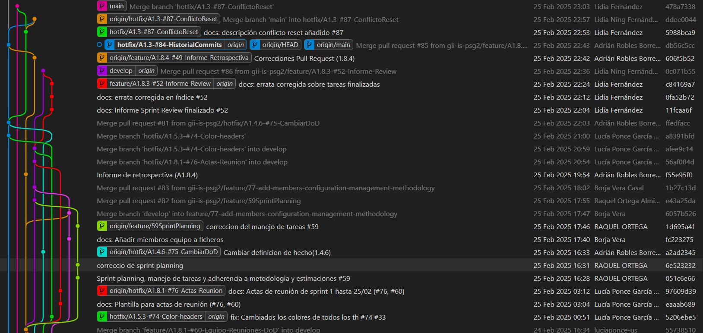
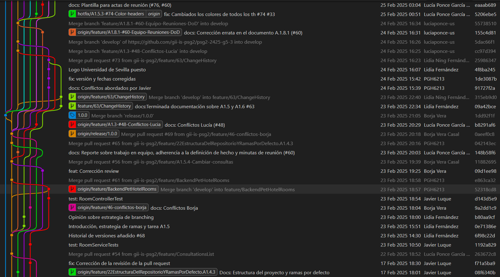
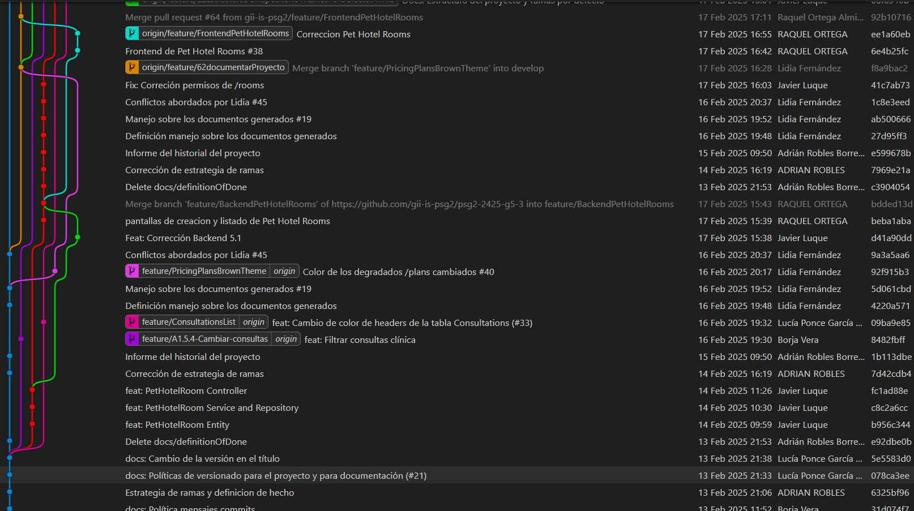
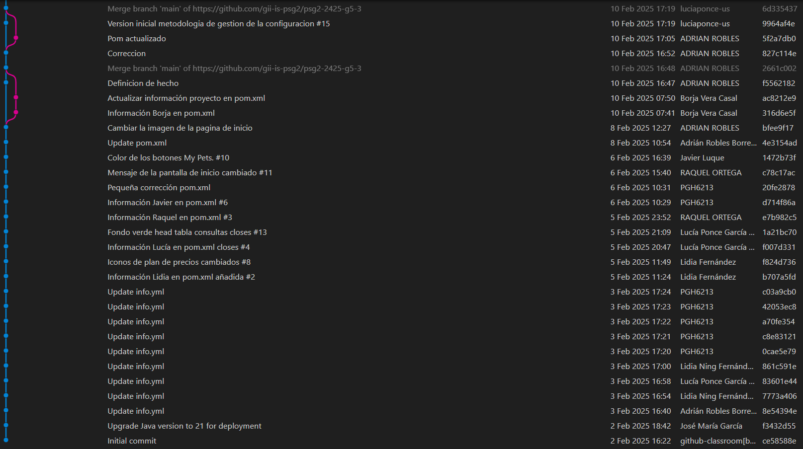

# Informe Técnico: Historial del Proyecto

## Miembros del equipo

| Nombre                        |
|-------------------------------|
| Adrián Robles Borrego         | 
| Lucía Ponce García de Sola    | 
| Lidia Ning Fernández Casillas | 
| Javier Luque Ruíz             | 
| Raquel Ortega Almirón         | 
| Borja Vera Casal              |

## Historial de versiones  

| Versión | Fecha      | Descripción de cambios |
|---------|------------|------------------------|
| 1.0.0   | 14/02/2025 | Versión inicial        |
| 1.1.0   | 15/02/2025 | Diagrama gráfico de commits del repositorio y conflictos añadidos |
| 1.2.0   | 16/02/2025 | Conflictos añadidos |
| 1.2.1   | 23/02/2025 | Conflictos añadidos |
| 1.2.2   | 24/02/2025 | Conflictos añadidos |

## 1. Introducción
Este informe documenta el historial del proyecto después de completar las tareas asignadas en el criterio de aceptación A1.2. Se incluye una línea de tiempo de commits, los conflictos encontrados y la manera en que fueron resueltos.

## 2. Línea de Tiempo de Commits
Se presenta a continuación la línea de tiempo de los commits:

 
 
 

## 3. Identificación y resolución de conflictos
- **Conflicto en imágenes de la página de inicio:** 
    - Identificación: Algunas imágenes no se mostraban correctamente, apareciendo recortadas en la interfaz.
    - Resolución: Se ajustaron las dimensiones y el formato de las imágenes para evitar recortes y garantizar una visualización adecuada en todos los dispositivos.

- **Conflicto al establecer nuevos iconos en los pricing plans:** 
    - Identificación: El icono de uno de los planes estaba girado hacia la derecha, por lo que al sustituir el icono original por uno nuevo, este aparecía doblado.
    - Resolución: Accediendo al estilo css que utilizaba este icono, se cambió la orientación de la imagen mostrada, visualizándose así el icono correctamente.
    
- **Conflicto al modificar el pom del proyecto con los datos del grupo:**
    - Identificación: Era necesario modificar los datos del pom, añadiendo el identificador del grupo.
    - Resolución: Se siguen los pasos explicados en el procedimiento para completar la tarea. Sin conflictos a la hora de mergear los cambios.
    
- **Conflicto al implementar las Pet Hotel Rooms:**
    - Identificación: Se han subido commits del frontend antes de que de que la pull request del backend fuera aceptada.
    - Resolución: Se terminó de implementar el backend y se comprobó que no hubiera conflictos con el frontend.
    
- **Lucía no tuvo conflictos, pero tuvo un problema al intentar evitarlos:**
    - Identificación: Lucía hizo pull antes de hacer commit, lo cual eliminó sus cambios locales sobre la política de versionado.
    - Resolución: Volvió a rehacer dicho apartado.
    
- **Conflicto al realizar la release:**
    - Identificación: Nuestro objetivo era desplegar el proyecto en App Engine, siguiendo el flujo habitual de trabajo. Para ello, creamos la rama release a partir de develop, con la intención de fusionarla posteriormente en main. Sin embargo, antes de completar el merge a main, un compañero notó un error: había subido accidentalmente su trabajo a main en lugar de a develop. Esto provocó que todos los cambios de develop se subieran directamente a main, dejando la rama actualizada antes de tiempo.
    Este error nos generó un problema, ya que ahora no podíamos mergear la rama release a main, puesto que esta última ya contenía los cambios de develop. Además, no estábamos seguros de si main había quedado correctamente sincronizada con todos los cambios subidos por error.
    - Resolución: Para corregir la situación, primero intentamos hacer un revert al commit anterior en main, pero esto no funcionó como esperábamos. Finalmente, optamos por un reset, lo que devolvió main a su estado original antes del error. Tras esto, pudimos realizar el merge correctamente y proceder con el despliegue sin más inconvenientes.

## 4. Conclusión
A pesar de algunos conflictos presentados, estos fueron resueltos eficientemente mediante revisiones y comunicación en equipo.

# Historial de Cambios en A1.5 y A1.6 por Lidia (E1.1) 

## 1. Introducción  
En esta sección se documentan los cambios realizados individualmente durante mi participación en las tareas A1.5 y A1.6. Se detallan las estrategias de branching utilizadas, las modificaciones implementadas en cada una de ellas y los conflictos de merge que se resolvieron, si los hubo.  

## 2. Estrategia de Branching Utilizada  
La estrategia de ramas que he llevado a cabo durante el desarrollo de ambas tareas va acorde con la estrategia definida por todos los miembros del equipo en el punto A1.4, que se describen de la siguiente manera:
- Uso de rama main únicamente para versiones estables, desplegadas y listas para producción.
- Uso de la rama develop para integrar todas las características del proyecto completas antes de su lanzamiento.
- Uso de ramas feature para desarrollar nuevas funcionalidades, con pequeos incrementos y de corta duración de vida.
- Uso de ramas releases para preparar una versión para su implementación.
- Uso de ramas hotfix para la corrección de errores críticos en producción.

Por lo tanto, para las tareas A1.5 y A1.6, concretamente para cada subtarea de esta misma, se crearon ramas feature siguiendo la convención feature/[issue referenciada]/[nombre de la funcionalidad a implementar], debido a que cada una de ellas se centraba en la implementación de una nueva funcionalidad, haciendo commit y realizando pull request una vez finalizada para que, una vez haya sido revisada por pares, dichos cambios realizados se mergearan a la rama develop.

## 3. Cambios Implementados  
### A1.5 - Cambiar el color de los gradientes mostrados en cada una de las tarjetas de la página /plans
  En cuanto a la tarea A1.5, personalmente estuve a cargo de realizar e implementar la subtarea correspondiente al cambio del color de los degradados que se mostraban en cada tarjeta de la página /plans, para que cada tarjeta usara diferentes tonos de marrón, asegurándome de que todos los lugares donde se mostraran los planes de precios (por ejemplo, para propietarios, propietarios de clínicas, etc.) usaran el mismo esquema de colores.

- Explicación de los cambios realizados para llevar a cabo la subtarea: 
    - Creación de la rama feature/PricingPlansBrownTheme: Siguiendo la estrategia de ramas, creé la correspondiente rama feature para poder implementar correctamente la nueva funcionalidad. Cabe recalcar que en esta rama no se referencia a ninguna issue debido a que en ese momento el equipo no tenía muy claro la forma de nombrar a las ramas, por ello la ausencia de esta a pesar de que la issue exista.
    - Una vez situada dentro de la nueva rama en mi workspace local, ejecuté el backend y luego el frontend para ver el estado original de la página /plans, sin que hubiera sufrido ningún cambio, con el objetivo de conocer el estado de partida.
    - Una vez visualizado y sin cerrar dicha página, me dirigí al componente App.js, donde se encuentran todas las rutas definidas y los correspondientes componentes a los que llama cada una de ellas. Busqué la ruta /plans, lo que me llevó al componente que llamaba dicha ruta.
    - Una vez en el componente, accedí al archivo css que contenía todos los estilos de esa página (../../static/css/pricing/pricingPage.css), concretamente a las líneas .pricing-container .pricing-card:nth-child(1,2,3) respectivamente. Dichas líneas definían los colores de los degradados de cada una de las tarjetas actuales, por lo que, para completar la tarea, solo tuve que cambiar esos colores a tonos marrones e ir revisando la página web de vez en cuando para asegurarme de que los cambios realizados eran los deseados.

- Archivos modificados y propósito de cada cambio:
    - Archivo pricingPage.css: cambié los colores de las siguientes 3 apartados, correspondiendo a cada una de las tarjetas:
        - .pricing-container .pricing-card:nth-child(1) → primera tarjeta BASIC
        - .pricing-container .pricing-card:nth-child(2) → segunda tarjeta GOLD
        - .pricing-container .pricing-card:nth-child(3) → tercera tarjeta PLATINUM
        
        Los colores fueron cambiados de forma que la menor tarifa tuviera un tono más oscuro, mientras que la mayor tuviera un tono más claro.

### A1.6 - Preparación de la release del proyecto y despliegue
En cuanto a la tarea A1.6, participé activamente en la reunión grupal donde se llevó a cabo esta actividad, la cual consistía en preparar una release del proyecto de Petclinic y, posteriormente, desplegarla en la web, resolviendo cualquier error o conflicto que surgiera.

Durante la sesión, estuve presente a lo largo de todo el proceso, comenzando por observar cómo uno de mis compañeros creaba la rama release correspondiente, asegurándome de que estábamos siguiendo correctamente los pasos y la metodología explicada en clase, y terminando por observar cómo otra de mis compañeras finalmente obtenía el link resultante del despliegue del proyecto.

Cuando llegamos al momento de hacer el merge de la rama release con main, surgió un problema técnico que no sabíamos cómo resolver de inmediato. Uno de los comandos que debíamos utilizar no funcionaba para mi compañero, por lo que me ofrecí voluntaria para probar la solución en mi propio espacio de trabajo, con el objetivo de verificar si el problema estaba relacionado con el entorno de mi compañero. Sin embargo, descubrimos que esa no era la causa del error.

Para el despliegue en App Engine, seguimos los pasos indicados en los apuntes de clase sin ningún problema.

Además, participé activamente en la discusión, planteando preguntas para aclarar ciertos puntos y aportando información relevante a los compañeros sobre los aspectos del trabajo que debíamos resolver. Me aseguré también de dejar claro lo que nos faltaba por hacer, identificando algunas dudas que podríamos plantear al profesor. Finalmente, realicé un resumen de los avances logrados, con el objetivo de que se pudieran generar las actas correspondientes de la reunión y establecer los siguientes pasos, para que todos estuviéramos alineados y claros sobre el trabajo pendiente.

## 4. Resolución de conflictos  
- Durante la realización de la tarea A1.5 no tuve que abordar ningún conflicto a la hora de hacer merge, todo ocurrió sin problemas. Esto puede deberse a una serie de razones y buenas prácticas llevadas a cabo:
    - Todas las tareas relacionadas con la página /plans fueron realizadas por mí, por lo tanto, nadie pudo haber modificado los archivos que se cambiaron, quitando todas las posibilidades de la existencia de conflictos en ese ámbito. 
    - Creación de la feature/PricingPlansBrownTheme a partir de develop: la rama feature se creó en base a la rama develop, por lo que partí desde la última versión del proyecto, trayéndome todos los cambios a mi workspace local antes de empezar a trabajar.

- Mientras trabajábamos en la tarea A1.6, nos encontramos con un problema al intentar hacer merge de la rama release con main. Resulta que uno de mis compañeros, por error, hizo un pull de develop a main, lo que provocó que, al intentar el merge, no hubiera cambios pendientes, ya que main ya estaba actualizado. Como no estábamos completamente seguros de que los cambios en main fueran los correctos, después de discutirlo, decidimos hacer un reset de la rama para devolverla al estado inicial antes de que ocurriera el problema. Tras esto, todo funcionó sin inconvenientes y pudimos continuar sin problemas.

## 5. Opinión sobre la Estrategia de Branching  
### Ventajas  
- **Mejor organización durante el desarrollo**: La separación entre ramas main, develop, feature, release y hotfix nos permite llevar a cabo una gestión estructurada del código, facilitando el desarrollo y la implementación de nuevas características.
- **Mayor estabilidad en producción**: Al utilizar main solo para versiones estables, evitamos la introducción de código en desarrollo que podría generar errores en el entorno de producción.
- **Facilita el trabajo en equipo**: Esta estrategia nos permite que varios desarrolladores trabajemos en diferentes funcionalidades sin tener que abordar interferencias, ya que cada uno trabaja en su propia rama feature.
- **Proceso de revisión más eficiente**: Al fusionar las ramas feature en develop solo después de revisiones y pruebas, se minimiza la posibilidad de errores en las versiones finales.
- **Corrección rápida de errores críticos**: Las ramas hotfix nos permiten solucionar problemas urgentes en producción sin afectar el desarrollo de las nuevas funcionalidades.
- **Mejor preparación para lanzamientos**: Las ramas release nos permiten estabilizar una versión antes de su implementación, asegurándonos así de que todos los detalles estén listos antes del despliegue.

### Desventajas  
- **Mayor complejidad en la gestión de ramas**: El hecho de tener que mantener varias ramas activas requiere disciplina por parte del equipo y un control adecuado para evitar desorganización o ramas obsoletas.
- **Posibles conflictos en la integración**: Si las ramas feature se desarrollan durante largos periodos sin sincronizarse con develop, pueden surgir conflictos de merge complejos al momento de integrarlas.
- **Mayor tiempo en revisiones y pruebas**: Aunque es una ventaja en términos de calidad, el proceso de revisión y pruebas antes de fusionar cambios puede ralentizar el desarrollo si no lo gestionamos adecuadamente.
- **Carga adicional en la gestión de versiones**: El mantenimiento de las ramas release y hotfix puede generar sobrecarga si no hay una planificación clara de versiones y correcciones.

## 6. Conclusión  
En conclusión, en mi opinión creo que esta estrategia de ramas ayuda a mantener el proyecto bastante organizado en todo momento y evita que se suban cambios inestables o incongruencias a producción. Además, facilita el trabajo en equipo y la revisión del código. Sin embargo, puede volverse un poco complicada si no se lleva un buen control de las ramas, especialmente cuando hay muchas en paralelo. Si el equipo se coordina, se comunica bien y sigue buenas prácticas, las ventajas superarán con creces a las desventajas que esta podría presentar.

# Historial de Cambios en A1.5 y A1.6 por Javier (E1.1) 

## 1. Introducción  
En esta sección se documentan los cambios realizados individualmente durante mi participación en las tareas A1.5 y A1.6. Se detallan las estrategias de branching utilizadas, las modificaciones implementadas en cada una de ellas y los conflictos de merge que se resolvieron, si los hubo.  

## 2. Estrategia de Branching Utilizada  
He seguido la estrategia de ramas acorada en el punto A1.4, que se describen de la siguiente manera:
- Main: usada únicamente para versiones estables, desplegadas y listas para producción.
- Develop : usada para integrar todas las características del proyecto completas antes de su lanzamiento.
- Feature:  usada para desarrollar nuevas funcionalidades.
- Releases: usada para preparar una versión para su implementación.
- Hotfix: usada para la corrección de errores críticos en producción.

Teniendo esto en cuenta; para cada subtarea se crearon ramas feature siguiendo el formato establecido. Se ha ido trabajando en cada rama de forma individual a través de commits; y cuando la nueva funcionalidad estaba lista, se hacía una pull request. Una vez que la pull request ha sido revisada por pares y aceptada con su correspondiente feedback, se realizaba un merge a la rama develop y se cerraba la issue correspondiente.

## 3. Cambios Implementados  
### A1.5 - Implementar el backend de las Hotel Pet Rooms.
  En cuanto a la tarea A1.5, desarrollé todo lo relacionado con el backend de las Hotel Pet Rooms, la nueva entidad que teníamos que crear.

- Explicación de los cambios realizados para llevar a cabo la subtarea: 
    - Creación de la rama feature/BackendPetHotelRooms: Siguiendo la estrategia de ramas, creé la correspondiente rama feature para poder implementar correctamente la nueva funcionalidad. El formato de la rama no es del todo correcto porque en este momento no teníamos definida al completo la sintaxis que íbamos a utilizar para las ramas.

    - Dentro de la nueva rama en mi workspace local, lo primero que hice fue crear la entidad Rooms.java, con sus correspondientes atributos, anotaciones y relaciones.
    
    - A continuación, empecé con la implementación típica de una nueva entidad. Primero, realicé el Repositorio correspondiente, extendiendo CRUD Repository, para poder acceder a todas las funcionalidades que iba a necesitar para el desarrollo de la tarea.

    - Lo siguiente que hice fue desarrollar el Service, implementando las siguientes funcionalidades: 
        - `findAll()`
        - `findRoomById(int roomId)`
        - `save`
        - `update`
        - `delete`
    
    - Y lo último que hice fue crear el Controller, añadiendo la url "/api/v1/rooms" a la api, y ofreciendo una ruta distinta para cada funcionalidad. Además, en el archivo "../configuration/SecurityConfiguration.java" le otorgué los permisos de las nuevas rutas: "/api/v1/rooms/**" a admin y a clinicOwner y la ruta por defecto a cualquiera que esté autenticado.

    - Como última aportación, y con el único propósito de asegurarme del correcto funcionamiento de la nueva entidad, diseé pruebas unitarias tanto para el Service como para el Controller, probando así todas las funiconalidades implementadas.

- Archivos modificados y propósito de cada cambio:
    - Room.java: Creación de la nueva entidad.
    - RoomRepository.java: Creación del repositorio extendiendo CRUDRepository.
    - RoomService.java: Implementación de las funcionalidades requeridas.
    - Archivo RoomRestController.java: Procesamiento de las peticiones HTTP para llamar al Service.
    - SecurityConfiguration.java: Autorización a los clinicOwners para crear, eliminar y editar PetHotelRooms.
    - RoomServiceTest.java: Pruebas unitarias del Service.
    - RoomControllerTest.java: Pruebas unitarias del Controller.

### A1.6 - Preparación de la release del proyecto y despliegue
En cuando a la tarea A1.6, participé en la reunión en la que se hizo el release y el despliegue de la aplicación. Observé como mis compañeros creaban la rama release correspondiente, mientras nos asegurábamos de que seguíamos los pasos sin cometer ningún error.

Preparamos todos los cambios que se habían quedado atrasados, y cuando estábamos listos para hacer el release surgió un problema al ejecutar un comando; se probó en varios workspace locales para asegurarnos de que no fuera un error aislado. El problema se explicará con más detalle en la próxima sección, pero al final lo pudimos resolver.

Mientras tanto, otra compañera estaba preparando el despliegue, por lo que en cuanto pudimos hacer la release y el merge, realizamos el despliegue de forma exitosa.

## 4. Resolución de conflictos  
- Durante la realización de la tarea A1.5 tuve que abordar un conflicto principal, debido a que esta tarea también tenía una parte de frontend, para poder representar las PetHotelRooms. Cada uno trabajamos en nuestra rama individual, pero no hubo la suficiente coordinación, y debido a ello, hubo un momento en el que en la rama develop se encontraba código del frontend que hacía referencia a funcionalidades del backend correspondiente a una pull request que todavía no se había aceptado. Lo solucionamos de la siguiente manera:

    - Primero nos aseguramos de que el backend funcionaba correctamente; se aceptó la pull request y se comprobó que las pruebas unitarias fueran positivas.
    - A continuación, se hizo un merge en develop con los cambios del frontend, y se comprobó que de la forma en la que se habían subido no provocaban ningún conflicto. Aunque es cierto que este contratiempo no causó ningún problema, esta falta de coordinación podría haber desencadenado muchos más conflictos mñás difíciles de solucionar, por lo que a partir de entonces hemos tenido más cuidado a la hora de aplicar la estrategia de ramas.

- Mientras trabajábamos en la tarea A1.6, nos encontramos con un problema al intentar hacer merge de la rama release con main. 
Sin darme cuenta, acepté una pull request que estaba dirigida a la rama main, por lo que al intentar hacer la release, no había cambios pendientes y no encontrábamos la manera de llevarlo a cabo. Después de discutir entre todos las posibles soluciones a este conflicto, decidimos realizar un reset de la rama main, ya que era la forma más efectiva de volver a un estado anterior de la rama y borrar el historial con commits innecesarios, por lo que pudimos realizar la tarea sin más problemas.

## 5. Opinión sobre la Estrategia de Branching  
### Ventajas  
- **Estructura clara y organizada**: Separa claramente el desarrollo, las nuevas características, los lanzamientos y las correcciones de errores.
- **Facilita el trabajo en equipo**: Al utilizar diferentes ramas, permite que los desarrolladores trabajen en paralelo sin afectar main ni develop.
- **Mayor efectividad en la coreción de errores críticos**: Gracias a las ramas hotfix, hemos podido solucionar problemas urgentes en producción sin afectar el desarrollo de las nuevas funcionalidades.
- **Mejor control de calidad antes de los lanzamientos**: Las ramas de release permiten realizar pruebas, revisiones de código y correcciones antes de fusionarlas en producción. Evita que cambios inestables lleguen a producción prematuramente.

### Desventajas  
- **Complejidad innecesaria en equipos pequeños**: Se requiere una mayor gestión de ramas y fusiones, lo que puede generar confusión innecesaria. El equipo necesita una mayor organización.
- **Mayor número de fusiones y conflictos**: Este modelo de ramas implica muchas fusiones entre ramas, lo que puede aumentar los conflictos de código.
- **Necesidad de revisión de cada rama feature**: Es cierto que en cuanto a caliddad es un plus, pero la eficiencia se ve mermada, ya que se crean muchas ramas feature, que a su vez necesitan una revisión.

## 6. Conclusión  
En conclusión, esta estrategia de ramas me parece una opción muy interesante en este tipo de trabajos. Facilita la implementación de las tareas de manera independiente, y la coordinación y el trabajo en equipo. El hecho de revisar cada rama antes de hacer un merge asegura la calidad del producto final, a pesar del coste de eficiencia, y la existencia de las ramas release y hotfix aseguran la fácil corrección de bugs. Por otro lado, aunque entiendo que en el contexto de la asignatura las ramas de las pull request que han sido aceptadas se tengan que mantener, si se pudieran cerrar mantenría el repositorio mucho más limpio y más organizado.

