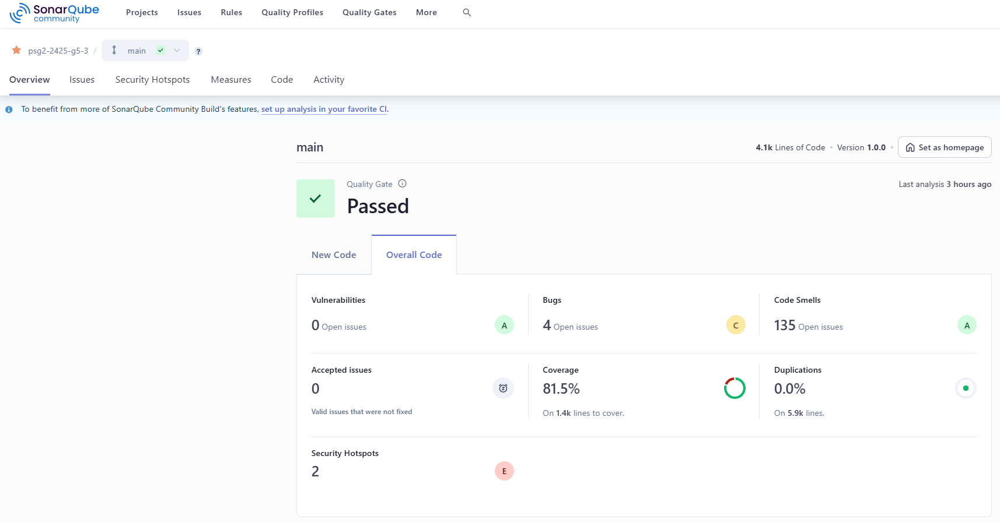
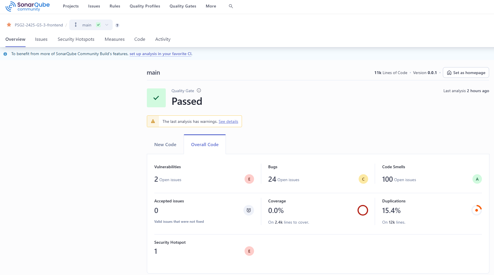

# Análisis del Código Fuente y Métricas Asociadas - Sprint 1

 

## Miembros del equipo

| Nombre                        |
|-------------------------------|
| Adrián Robles Borrego         | 
| Lucía Ponce García de Sola    | 
| Lidia Ning Fernández Casillas | 
| Javier Luque Ruíz             | 
| Raquel Ortega Almirón         | 
| Borja Vera Casal              | 

## Historial de versiones  

| Versión | Fecha      | Descripción de cambios             |
|---------|------------|------------------------------------|
| 1.0.0   | 13/03/2025 | Versión inicial                    |
| 1.1.0   | 25/03/2025 | Errores de numeración corregidos 1 |

## Índice

1. [Introducción](#1-introducción)
2. [DashBoard de SonarQube](#2-dashboard-de-sonarqube)
3. [Análisis de Métricas](#3-análisis-de-métricas)
    1. [Resumen de Métricas - Backend](#31-resumen-de-métricas---backend)
    2. [Resumen de Métricas - Frontend](#32-resumen-de-métricas---frontend)
4. [Análisis de errores potenciales](#4-análisis-de-errores-potenciales)
    1. [Bugs - Backend](#41-bugs---backend)
    2. [Bugs - Frontend](#42-bugs---frontend)
5. [Análisis de Code Smells](#5-análisis-de-code-smells)
    1. [Code Smells en el Backend](#51-code-smells-en-el-backend)
    2. [Code Smells en el Frontend](#52-code-smells-en-el-frontend)
6. [Conclusiones](#6-conclusiones)


## 1. Introducción

En este informe se presenta el análisis del código fuente y las métricas asociadas de nuestro proyecto durante el Sprint 1. El análisis se ha realizado utilizando la herramienta SonarQube, que proporciona un conjunto de métricas clave para evaluar la calidad del código en términos de mantenibilidad, fiabilidad y seguridad. Este análisis abarca tanto el Backend como el Frontend de la aplicación, permitiendo detectar problemas potenciales, como bugs, code smells y vulnerabilidades.

Este análisis tiene como objetivo mejorar la calidad del software, asegurar la correcta evolución del proyecto y minimizar posibles problemas a lo largo del ciclo de desarrollo.

## 2. DashBoard de SonarQube

### **2.1. Backend**

 

### **2.2. Frontend**




## 3. Análisis de Métricas

El análisis de SonarQube nos proporciona métricas clave sobre la calidad del código en nuestro proyecto. A continuación, desglosamos los valores obtenidos y su impacto en la mantenibilidad y fiabilidad del código.

### **3.1. Resumen de Métricas - Backend**
- Dashboard del Backend: 

    | Métrica                  | Valor   | Interpretación |
    |--------------------------|---------|---------------|
    | **Vulnerabilidades**     | 0       | No se detectaron vulnerabilidades de seguridad en el código. |
    | **Bugs**                | 4       | Se han encontrado 4 errores que podrían afectar el funcionamiento del software. |
    | **Code Smells**         | 135     | Hay 135 problemas relacionados con la mantenibilidad del código. |
    | **Security Hotspots**   | 2       | Son puntos en el código que requieren revisión manual para verificar su seguridad. |
    | **Coverage (Cobertura de Tests)** | 81.5%  | Un buen porcentaje de cobertura, indicando que la mayoría del código está probado. |
    | **Duplications (Duplicación de código)** | 0.0% | No hay código duplicado, lo cual es positivo para la mantenibilidad. |

### **3.2. Resumen de Métricas - Frontend**
- Dashboard del frontend:

    | Métrica                  | Valor   | Interpretación |
    |--------------------------|---------|---------------|
    | **Vulnerabilidades**     | 2       | Se han detectado 2 posibles vulnerabilidades que requieren revisión. |
    | **Bugs**                | 24      | Se han encontrado 24 errores que podrían afectar el funcionamiento del software. |
    | **Code Smells**         | 100     | Hay 100 problemas relacionados con la mantenibilidad del código. |
    | **Security Hotspots**   | 1       | Es necesario revisar manualmente este punto para determinar si representa un riesgo. |
    | **Coverage (Cobertura de Tests)** | 0.0%  | No hay cobertura de tests, lo que indica que el código no ha sido probado automáticamente. |
    | **Duplications (Duplicación de código)** | 15.4% | Un porcentaje elevado de duplicación, lo que puede afectar la mantenibilidad del código. |


## 4. Análisis de errores potenciales

### **4.1. Bugs - Backend**


El análisis de errores potenciales (bugs) detectados por SonarQube en el backend muestra 4 problemas abiertos. En esta sección, identificaremos el tipo de errores encontrados, sus causas y el impacto en el sistema.

| Archivo y Tipo de Bug                  | Descripción   | Posible Causa | Severidad |
|--------------------------|-------------- |-------------- |--------- | 
| **ClinicService.java** (`Remove this conditional structure or edit its code blocks so that they're not all the same.`)   | Código condicional con estructuras repetidas      |Código redundante y sin optimización | **Mayor** | 
| **ClinicOwnerService.java** (`Call Optional#isPresent() or !Optional#isEmpty() before accessing the value.`) | Se accede a valores sin verificar si Optional está vacío | Falta de uso de `Optional#isPresent()` o `Optional#isEmpty()` | **Mayor** | 
| **RoomService.java** (`Call Optional#isPresent() or !Optional#isEmpty() before accessing the value.`) | 	Se accede a valores sin verificar si Optional está vacío | Mismo problema que en ClinicOwnerService.java | **Mayor** |
| **VisitRestController.java** (`Bind path variable "petId" to a method parameter.`) | No se está vinculando correctamente una variable petId en un método  | Falta de anotación adecuada en el parámetro del método | **Mayor** |

### **4.2. Bugs - Frontend**

El análisis de SonarQube ha identificado 24 bugs en el código del frontend, los cuales se pueden agrupar en 4 categorías principales. A continuación, se describe cada tipo de error, sus causas y las soluciones recomendadas.

| Tipo de Bug | Cantidad | Descripción | Posible Causa | Severidad |
|------------|----------|-------------|---------------|-----------|
| **Uso incorrecto de `setState` en React** (`Use callback in setState when referencing the previous state`) | 20 | Se usa `setState` sin utilizar la versión con callback, lo que puede causar inconsistencias en el estado. | No se respeta la asincronía de `setState`, provocando accesos a valores desactualizados. | **Mayor** |
| **Duplicación de propiedades en CSS** (`Unexpected duplicate "property" `) | 2 | Existen propiedades CSS duplicadas en el mismo selector. | Código CSS no optimizado o errores en la edición. | **Mayor** | 
| **Falta de una fuente genérica en CSS** (`Unexpected missing generic font family`) | 1 | No se especifica una fuente alternativa en `font-family`. | Se define solo una fuente específica sin incluir una alternativa genérica. | **Mayor** | 
| **Estructuras condicionales redundantes** (`Remove this conditional structure or edit its code blocks so that they're not all the same`) | 1 | Código condicional con bloques de ejecución repetitivos. | Mala organización del código y falta de refactorización. | **Mayor** |


## 5. Análisis de Code Smells

### 5.1. Code Smells en el Backend

El análisis de SonarQube ha identificado un total de 135 code smells en el backend de nuestro proyecto, distribuidos de la siguiente manera:

- Gravedad Info: 8 code smells.

- Gravedad Minor: 36 code smells.

- Gravedad Major: 90 code smells.

- Gravedad Critical: 1 code smell.

A continuación, se analizará en detalle el code smell de gravedad critical, seguido de ejemplos representativos de los code smells major, minor e info.

### 5.1.1. Code Smell de Gravedad Critical

#### Inyección de Dependencias en Configuración

- **Descripción:** Este code smell ocurre cuando se inyectan dependencias en una clase @Configuration usando @Autowired en atributos de clase. Esto puede afectar la inicialización del contexto de Spring y dificultar la mantenibilidad del código.

- **Causa en el código:** Se inyectan dependencias en campos de clase en lugar de hacerlo en métodos o constructores.

- **Evaluación de la severidad:**

    - Impacto en la mantenibilidad: Dificulta la comprensión del código.

    - Riesgo de inicialización: Puede generar problemas en el ciclo de vida del contexto de Spring.

    - Buenas prácticas: Se recomienda inyectar dependencias en el constructor o en métodos en lugar de en campos de clase.

- **Solución:** Inyectar las dependencias directamente en el método que las necesita en lugar de declararlas como atributos de clase.

### 5.1.2. Code Smells de Gravedad Major

#### Código Comentado sin Uso

- **Descripción:** Se han encontrado bloques de código comentados que deberían ser eliminados para mejorar la claridad y mantenibilidad del código.

- **Causa en el código:** Se mantiene código comentado que ya no es relevante o que debería ser eliminado si no es necesario.

- **Evaluación de la severidad:**

    - Impacto en la claridad del código: Puede confundir a futuros desarrolladores.

    - Código innecesario: Mantener código comentado sin uso es una mala práctica.

- **Solución:** Eliminar los comentarios innecesarios para evitar confusión y mejorar la legibilidad.

### 5.1.3. Code Smells de Gravedad Minor

#### Importaciones no utilizadas

- **Descripción:** Se han encontrado importaciones en el código que no están siendo utilizadas.

- **Causa en el código:** Se importan clases que no se utilizan en el código, aumentando la complejidad visual.

- **Evaluación de la severidad:**

    - Impacto en la claridad del código: Importaciones innecesarias aumentan la complejidad visual.

    - Eficiencia: Código más limpio y optimizado.

- **Solución:** Eliminar las importaciones no utilizadas para mejorar la claridad y reducir el desorden en el código.

### 5.1.4. Code Smells de Gravedad Info

#### Comentarios TODO sin resolver

- **Descripción:** Se han detectado comentarios TODO que deberían ser completados.

- **Causa en el código:** Se dejaron anotaciones TODO en el código sin completarlas, lo que puede indicar tareas pendientes no documentadas adecuadamente.

- **Solución:** Completar la tarea pendiente o eliminar el comentario si ya no es relevante.

### 5.2. Code Smells en el Frontend

El análisis de SonarQube ha identificado un total de 100 code smells en el frontend de nuestro proyecto, distribuidos de la siguiente manera:

- Gravedad Minor: 41 code smells.

- Gravedad Major: 57 code smells.

- Gravedad Critical: 2 code smell.

A continuación, se analizará en detalle el code smell de gravedad critical, seguido de ejemplos representativos de los code smells major, minor e info.

#### 5.2.1. Code Smells de Gravedad Critical

#### Complejidad Cognitiva Excesiva en Componentes

- **Descripción:**: La función FormInput tiene una complejidad cognitiva de 27, superando el límite recomendado de 15.

- **Código afectado:**
```
const FormInput = forwardRef(({ tag, name, type, defaultValue, values, isRequired, 
                    numberOfColumns, validators, minValue, maxValue, onChange, disabled}, ref) => {
```

- **Solución:** Refactorizar la función para reducir su complejidad cognitiva.

#### 5.2.2. Code Smells de Gravedad Major

#### Eliminación de Asignaciones Innecesarias

- **Descripción:** Se detectó una asignación innecesaria a la variable setClinics, la cual no se usa posteriormente.

- **Código afectado:**
```
const [clinics, setClinics] = useFetchState(
```

- **Solución:** Eliminar la asignación innecesaria a setClinics.

#### 5.2.3. Code Smells de Gravedad Minor

#### Uso Redundante de Fragmentos en React

- **Descripción:** Se utiliza un fragmento <></> con un único hijo, lo cual es innecesario.

- **Código afectado:**
```
if (role === "VET") {
    ownerLinks = (
        <>
            <NavItem>
                <NavLink style={{ color: "white" }} tag={Link} to="/consultations">Consultations</NavLink>
            </NavItem>
        </>
```

- **Solución:** Eliminar el fragmento innecesario y dejar solo el elemento hijo.

## 6. Conclusiones
El análisis de SonarQube revela que el backend tiene buena cobertura de pruebas (81.5%) y cero vulnerabilidades, mientras que el frontend presenta problemas críticos como falta de tests (0% de cobertura) y un 15.4% de código duplicado.

Se han detectado 4 bugs en el backend y 24 en el frontend, principalmente relacionados con la gestión del estado en React y código redundante. Además, hay 235 code smells en total, destacando problemas de inyección de dependencias, código comentado sin uso e importaciones innecesarias.

Para mejorar la calidad del código, se recomienda:

- Corregir los bugs y code smells más críticos.
- Reducir la duplicación de código en frontend.
- Implementar tests en frontend.

Siguiendo estas acciones, se mejorará la mantenibilidad, seguridad y fiabilidad del software.