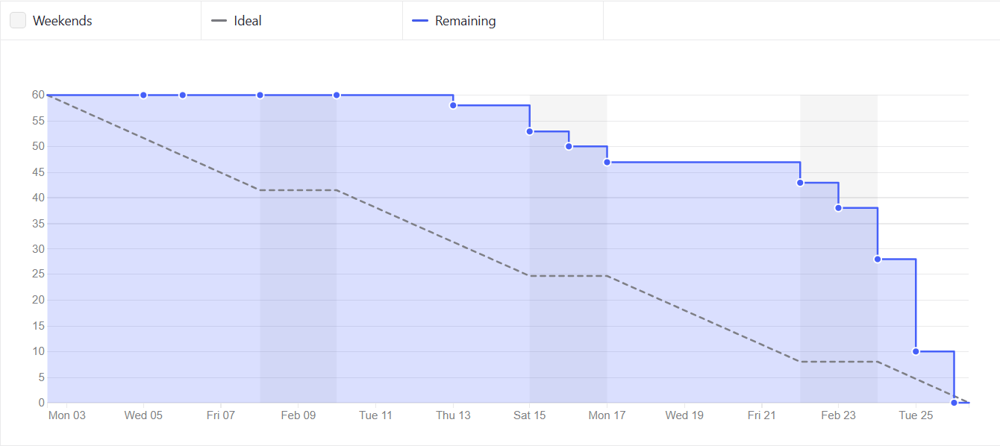
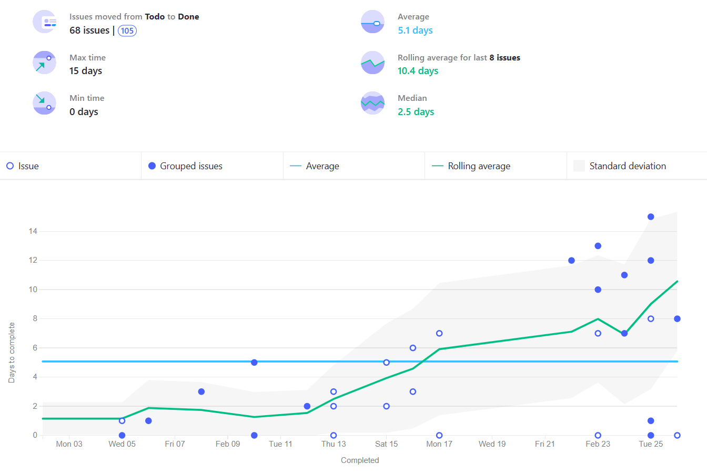
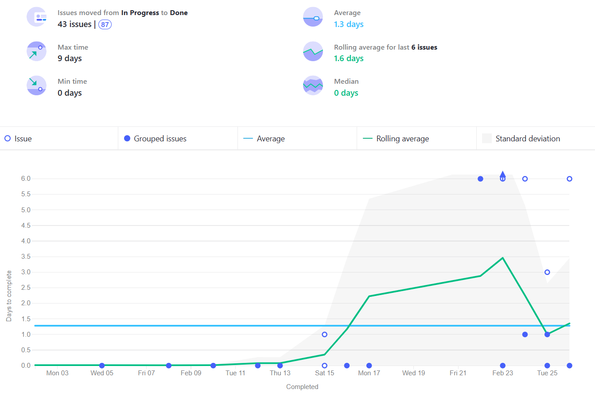
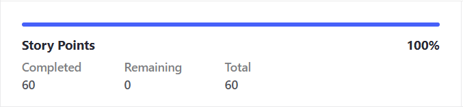
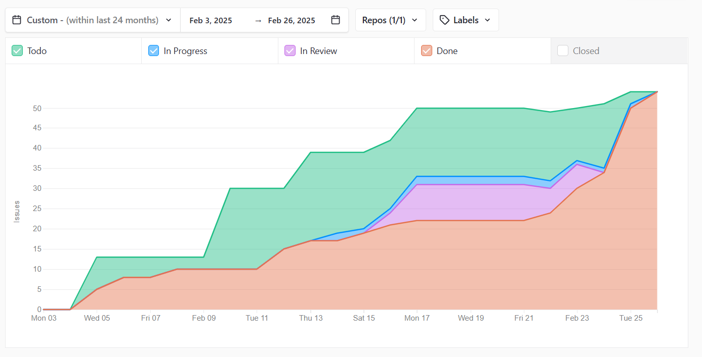

# Métricas de Proceso Ágil y Recursos

 

## Miembros del equipo

| Nombre                        |
|-------------------------------|
| Adrián Robles Borrego         | 
| Lucía Ponce García de Sola    | 
| Lidia Ning Fernández Casillas | 
| Javier Luque Ruíz             | 
| Raquel Ortega Almirón         | 
| Borja Vera Casal              | 

## Historial de versiones  

| Versión | Fecha       | Descripción de cambios |
|---------|------------|------------------------|
| 1.0.0   | 06/03/2025 | Versión inicial. Primeros gráficos añadidos. |
| 1.1.0   | 22/03/2025 | Versión final. Documento completo. |

## Índice
1. [Introducción](#1-introducción)
2. [Gráfico Milestone Burn Down](#2-gráfico-milestone-burn-down)
3. [Gráfico Lead Time](#3-gráfico-lead-time)
4. [Gráfico Cycle Time](#4-gráfico-cycle-time)
5. [Total puntos de historia entregados](#5-total-puntos-de-historia-entregados)
6. [Porcentaje de puntos de historia entregados](#6-porcentaje-de-puntos-de-historia-entregados)
7. [Gráfico Bottleneck](#7-gráfico-bottleneck)

## 1. Introducción

En este documento presentamos las principales métricas y recursos utilizados en metodologías ágiles, basados en los datos proporcionados por ZenHub, la herramienta de gestión de proyectos empleada en este trabajo. Evaluaremos la eficiencia del equipo, el flujo de trabajo y otros aspectos clave en relación con las actividades realizadas durante el Sprint 1. A través del análisis de estas métricas, buscamos establecer una guía para la mejora continua, optimizando el rendimiento del equipo y la entrega de valor en entornos de desarrollo ágil.

## 2. Gráfico Milestone Burn Down

Este gráfico muestra la evolución del trabajo restante a lo largo del Sprint 1, comparando la cantidad de trabajo planificado con el tiempo disponible. Visualmente, representa cómo el equipo gestionó la finalización de tareas a lo largo del sprint, indicando si el progreso fue constante, si hubo bloqueos o si se aceleró la entrega en los últimos días. Gracias a esta métrica, fue posible evaluar si el equipo se mantuvo alineado con los objetivos previstos y detectar posibles desviaciones en la planificación.

En el gráfico resultante, se puede observar que durante los primeros días del sprint, el progreso fue limitado, lo que sugiere que el equipo adoptó un enfoque más relajado en las etapas iniciales. Sin embargo, a medida que avanzó la segunda semana, se empezó a evidenciar un progreso constante. Es destacable que los días en los que se registró un mayor avance fueron principalmente durante los fines de semana, mientras que entre semana la actividad fue presente, pero con un ritmo menos marcado. Finalmente, se puede apreciar que conforme se acercaba la fecha de entrega del sprint, el ritmo de trabajo del equipo se aceleró de manera considerable, reflejando un esfuerzo intensificado para completar las tareas a tiempo.

## 3. Gráfico Lead Time

El gráfico Lead Time refleja el tiempo total transcurrido desde que una tarea fue registrada en el estado _To Do_, indicando que estaba pendiente de ser trabajada, hasta que alcanzó el estado _Done_, señalando su finalización durante el Sprint 1. Esta métrica permite evaluar la eficiencia del flujo de trabajo, identificando posibles retrasos y oportunidades de mejora en el proceso de desarrollo.

En el gráfico resultante podemos observar que la mayoría de las tareas tienen un buen ritmo y se completan dentro del tiempo estimado, dejando poco margen. Aunque hay algunas tareas que se exceden ligeramente en el tiempo, estas no generan un impacto significativo si las comparamos con la cantidad de tareas que se completan correctamente dentro del tiempo estipulado. Esto indica que, en general, el equipo mantiene un rendimiento consistente y eficiente, con pocas variaciones que afecten el flujo global de trabajo.

## 4. Gráfico Cycle Time

El gráfico Cycle Time presenta el tiempo total transcurrido desde que una tarea comenzó a estar en el estado _In Progress_ hasta su finalización en el estado _Done_ durante el Sprint 1. Esta métrica permite evaluar la eficiencia del flujo de trabajo del equipo, identificando posibles cuellos de botella, variabilidad en los tiempos de entrega y áreas de mejora en el proceso de desarrollo. A través del análisis del Cycle Time, es posible obtener información valiosa sobre la velocidad de trabajo y la capacidad de entrega del equipo en este primer sprint.

En el gráfico resultante podemos observar que la mayoría de las tareas se mantienen en la fase de in progress durante un tiempo inferior al estimado, lo que indica que se están completando más rápido de lo previsto. Sin embargo, en el otro extremo, algunas tareas presentan un tiempo de finalización superior al estimado. Este comportamiento sugiere que es necesario mejorar la forma en que realizamos las estimaciones, para ajustarlas de manera más precisa a la realidad de los tiempos de ejecución.
A pesar de estas variaciones, en términos generales, el equipo se mantiene dentro de la zona segura, lo que indica que, aunque hay espacio para optimizar las estimaciones, no hay riesgos inminentes que afecten negativamente el flujo de trabajo.

## 5. Total puntos de historia entregados

El total de puntos de historia entregados refleja la cantidad de trabajo completado durante el Sprint 1, medido en función de las estimaciones iniciales asignadas a cada tarea.

Durante el Sprint 1, el equipo logró completar un total de 60 puntos de historia de los 60 puntos planificados. Este resultado demuestra que el equipo fue capaz de abordar y completar el alcance total del sprint, evidenciando una planificación y ejecución eficiente.

El análisis de esta métrica confirma que el equipo mantuvo un ritmo de trabajo constante y alineado con las expectativas iniciales, lo que refuerza la capacidad del equipo para estimar y ejecutar tareas de manera efectiva.

## 6. Porcentaje de puntos de historia entregados

El porcentaje de puntos de historia entregados refleja la efectividad del equipo en relación con las expectativas iniciales de entrega.

En este sprint, el equipo logró completar el 100% de los puntos de historia planificados, lo que indica que:

- El equipo ha mantenido un rendimiento excepcional, cumpliendo con la totalidad de los objetivos del sprint.

- La consistencia entre la planificación y la entrega evidencia una buena capacidad para estimar el esfuerzo requerido para completar las tareas.

- La ausencia de desviaciones significativas sugiere una fuerte coordinación y ejecución por parte de todos los miembros del equipo.

## 7. Gráfico Bottleneck

El gráfico Bottleneck o Diagrama de Flujo Acumulado muestra la evolución de las tareas a lo largo del Sprint 1, diferenciando entre los estados de To Do, In Progress, In Review y Done. Este gráfico permite identificar posibles cuellos de botella en el proceso de desarrollo, ya que revela en qué fase del flujo de trabajo se acumulan las tareas.

### Análisis:

- En las primeras fases del sprint, se observa un incremento gradual de las tareas en el estado To Do, lo que indica que el equipo fue acumulando trabajo pendiente de manera progresiva.

- A partir del día 17 de febrero, se aprecia un aumento notable en el estado In Progress y In Review, lo que sugiere que el equipo comenzó a trabajar de manera más activa para mover las tareas hacia la finalización.

- Podemos observar que el día 22 de febrero hay un leve descenso de las tareas en el estado In Progress o In Review. Esto podría ser por que se hayan movido de "In Progress" o "In Review" a "Todo" o directamente a "Done".

- El pico más alto en In Review ocurrió alrededor del día 23 de febrero, lo que podría indicar un cuello de botella en la fase de revisión.

- Sin embargo, hacia el final del sprint (día 25 de febrero), se observa una disminución rápida en los estados In Progress y In Review, mientras que las tareas en Done aumentan considerablemente, lo que indica que el equipo hizo un esfuerzo concentrado para completar el trabajo pendiente antes de la fecha límite.

El análisis del gráfico Bottleneck muestra que, aunque hubo una acumulación temporal de tareas en la fase de revisión, el equipo fue capaz de resolver eficazmente esta situación y completar la totalidad de las tareas planificadas. Este comportamiento refleja una capacidad de reacción positiva y una buena coordinación en la recta final del sprint.