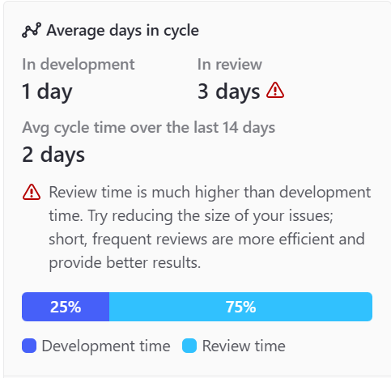

# Sprint planning

 

## Índice
1. [Sprint planning](#1-sprint-planning)
2. [Manejo de Tareas](#2-manejo-de-tareas)
3. [Adherencia a Metodología Ágil y Estimaciones](#3-adherencia-a-metodología-ágil-y-estimaciones)
4. [Conclusión](#4-conclusión)

## 1. Sprint Planning

| Id. Issue | Decripción                                                                        | Asignación     |
| --------- | --------------------------------------------------------------------------------- | -------------- |
| A1.1      | Responder preguntas del sprint                                                    | Todos          |
| A1.2.1    | Añadir informacion al pom.xml                                                     | Todos          |
| A1.2.2    | Añadir informacion del proyecto al pom.xml                                        | Borja          |
| A1.2.3    | Cambiar iconos de la pantalla de pricing plans                                    | Lidia          |
| A1.2.4    | Cambiar colores de los botones de Pets                                            | Javier         |
| A1.2.5    | Cambiar el mensaje de la pantalla de Home                                         | Raquel         |
| A1.2.6    | Cambiar imagen de fondo de la pantalla de Home                                    | Adrián         |
| A1.2.7    | Cambiar el color del fondo del encabezado de la tabla de Consultas                | Lucía          |
| A1.3      | Reporte técnico del historial de tareas                                           | Todos          |
| A1.3.a    | Diagrama grafico de commits del repositorio                                       | Adrián         |
| A1.3.b    | Añadir historial de versiones al documento                                        | Lidia          |
| A1.4.1    | Estandares de codificacion                                                        | Raquel         |
| A1.4.2    | Politica de los mensajes de los commits                                           | Borja          |
| A1.4.3    | Estructura de los repositorios y ramas                                            | Lidia, Javier  |
| A1.4.4    | Estrategia de ramificacion basada en GitFlow                                      | Adrián         |
| A1.4.5    | Politica de versionado                                                            | Lucía          |
| A1.4.6    | Definicion de hecho                                                               | Adrián         |
| A1.4.7    | Gestion de documentacion                                                          | Lidia          |
| A1.5.1    | Funcionalidad de Hotel para mascotas                                              | Javier, Raquel |
| A1.5.2    | Cambiar el color de los gradientes de la pantalla de pricing plans                | Lidia          |
| A1.5.3    | Cambiar el color del encabezado de Consultas                                      | Lucía          |
| A1.5.4    | Cambiar comportamiento de las consultas para propietarios o veterinarios          | Borja          |
| A1.6      | Crear rama de lanzamiento y App Engine                                            | Todos          |
| A1.8.1    | Trabajo en equipo, reuniones y adherencia a la definicion de hecho                | Lucía          |
| A1.8.2    | Sprint Planning, manejo de tareas y adherencia a metodologia y estimaciones       | Raquel         |
| A1.8.3    | Sprint review                                                                     | Lidia          |
| A1.8.4    | Spring retrospective                                                              | Adrián         |
| E1.1      | Historial de cambios hechos durante mi participacion en las tareas de A1.5 y A1.6 | Lidia          |

## 2. Manejo de Tareas

### 2.1. Creación y Asignación

Para gestionar las tareas de manera eficiente, hemos utilizado ZenHub.
Las tareas se crean en forma de issues de GitHub y cada una debe tener:

- Un nombre explicativo (Ej.: Funcionalidad Pet Hotel)
- Una etiqueta de identificación (Ej.: A1.8.2)
- Una estimación de esfuerzo usando la estrategia planning poker para asignar los puntos de historia
- Solo una persona asignada a una tarea y otra persona (distinta) a su revisión

### 2.2. Seguimiento

Para el seguimiento de las tareas se usa el dashboard de Zenhub y las weekly stand-up meetings que se realizan cada semana. También se lleva un registro en Clockify de las horas que cada persona dedicó a cada tarea. En definitiva, contamos finalmente con dos documentos en formato pdf para llevar a cabo el análisis final del rendimiento del sprint, siendo uno de ellos un informe detallado con cada una de las tareas realizadas progresivamente por cada uno de los miembros del grupo, y otro informe general con gráficos más visuales. Ambos informes pueden encontrarse en la carpeta del _sprint 1_ que se encuentra dentro de la carpeta _docs_ del proyecto.

## 3. Adherencia a Metodología Ágil y Estimaciones

### 3.1. Buenas Prácticas

Se han seguido buenas praticas de las estudiadas en la asignatura como:

- Daily Stand-ups.
- Revisiones y retrospectivas.
- Tablero visual de seguimiento (Zenhub)

### 3.2.Estimaciones

En nuestro equipo, hemos utilizado Planning Poker como técnica principal para estimar el esfuerzo de las tareas del Sprint, facilitado por ZenHub.
Un problema que nos hemos encontrado es que nuestro tiempo de revision es mas alto al estimado como vemos en la siguiente imagen:

## 4. Conclusión

El éxito en la gestión de Sprints y tareas depende de una planificación clara, una ejecución disciplinada y una mejora continua basada en el aprendizaje del equipo. Aplicar estas prácticas permitirá mantener la eficiencia.

