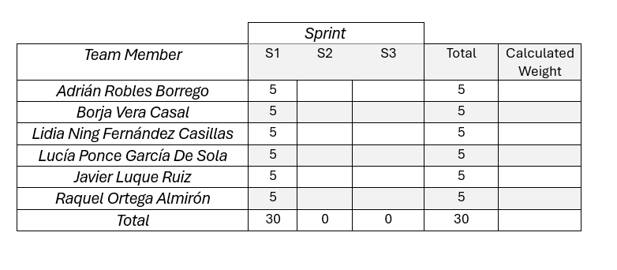

# Informe de Retrospectiva Sprint 1

 

## Índice

1. [Introducción](#1-introducción)
2. [Miembros Del Equipo De Trabajo](#2-miembros-del-equipo-de-trabajo)
3. [Evaluación De Los Métodos Del Equipo Y Posibles Mejoras](#3-evaluación-de-los-métodos-del-equipo-y-posibles-mejoras)
4. [Plan De Acción](#4-plan-de-acción)
5. [Tabla De Rendimiento](#5-tabla-de-rendimiento)

---

## **1. Introducción**
El siguiente documento nos permite identificar qué aspectos se han realizado correctamente durante el sprint y elaborar un plan de mejora para optimizar aquellos que requieren ajustes en el próximo sprint.

---

## **2. Miembros del equipo de trabajo**
- Adrián Robles Borrego.
- Borja Vera Casal.
- Lidia Ning Fernández Casillas.
- Lucía Ponce García De Sola.
- Javier Luque Ruiz.
- Raquel Ortega Almirón.

---

## **3. Evaluación de los métodos del equipo y posibles mejoras**
En esta sección se presentarán las propuestas de mejora del equipo para optimizar su desempeño, luego de analizar la situación al cierre del primer sprint.
- **Establecer roles y responsabilidades más claros dentro del equipo:** Definir roles específicos más rápidamente para evitar confusiones y garantizar que cada miembro contribuya de manera efectiva.
- **Mejorar la repartición de tareas:** Hemos tenido problemas al aplicar la estrategia de planning poker, dado que algunas tareas se asignaron sin evaluar la estimación. Debemos aplicar la estimación planning poker desde el inicio, para asegurar que todas las tareas sean evaluadas antes de ser asignadas.
- **Fortalecer la documentación del proyecto:** Estructurar la documentación de manera correcta con portada, índices, ejemplos...

---

## **4. Plan de acción**
Este plan de acción tiene como propósito definir medidas específicas para optimizar la eficiencia y el desempeño del equipo. Se organiza en tres categorías: Start, Stop y Continue Doing, donde se identificarán las actividades que el equipo debe comenzar, dejar de hacer y seguir realizando, respectivamente. Con esta estructura, el equipo podrá enfocarse en los aspectos clave para mejorar su rendimiento y alcanzar sus objetivos. Algunas de estas acciones ya han sido mencionadas previamente.

### 🆕 Start:
- Establecer roles y responsabilidades más claros y de forma más rápida.
- Optimizar la asignación de tareas considerando la carga de trabajo total mediante la evaluación de la complejidad de cada tarea.
- Mejorar la retrospectiva y la retroalimentación de manera constructiva.

### ❌ Stop:
- Dejar de depender exclusivamente del Whatsapp como medio de comunicación y comenzar a utilizar herramientas colaborativas más eficientes.
- Detener la procrastinación y abordar de inmediato los problemas y desafíos que surjan durante el desarrollo del proyecto.
- Detener la asignación de tareas sin una comunicación clara sobre las expectativas y los plazos, lo que puede generar confusión y retrasos.

### ✅ Continue Doing: 
Se utilizan porcentajes para mostrar el grado de cumplimiento de las siguientes practicas de equipo, un porcentaje alto indica que se ha cumplido con creces el área de prácticas: 
- Mantener los daily meetings para evaluar el progreso del equipo y hacer ajustes según sea necesario. --> (70%)
- Continuar empleando ZenHub para llevar una correcta organización de las tareas. --> (80%)
- Mantener la obligación de que otro miembro del equipo tenga que evaluar el commit antes de poder ser subido. --> (100%)
- Mantener un ambiente de trabajo positivo para promover el crecimiento y el éxito del equipo. --> (90%)

---

## **5. Tabla de rendimiento**
Esta sección se centra en la evaluación del desempeño individual. Luego de un análisis justo del rendimiento durante el sprint, se ha determinado que todos los miembros del equipo recibirán la misma puntuación final, dado que hemos aportado equitativamente al proyecto. A continuación, se presenta la tabla de rendimiento final para este primer sprint.

 