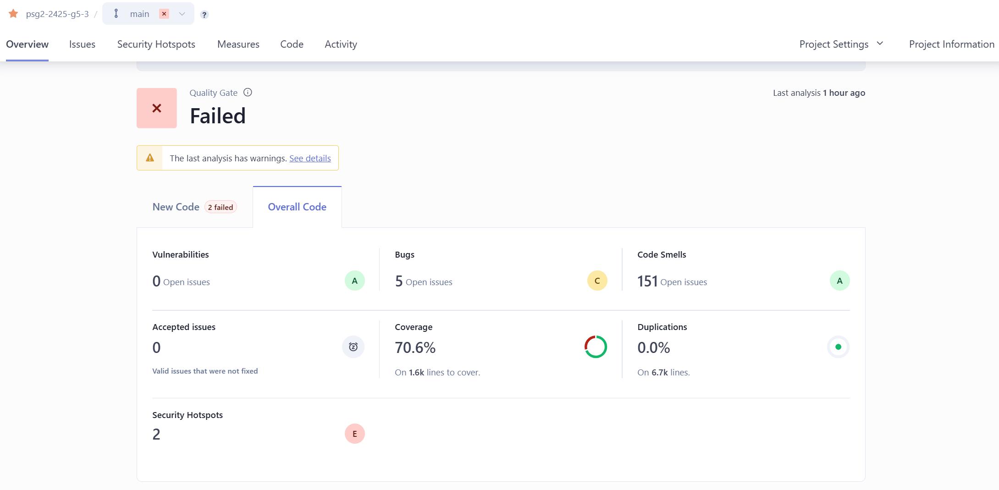
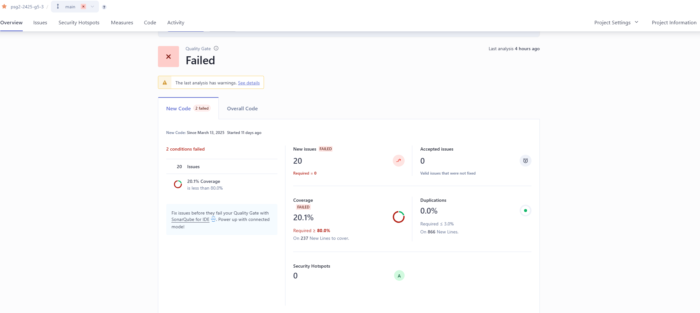
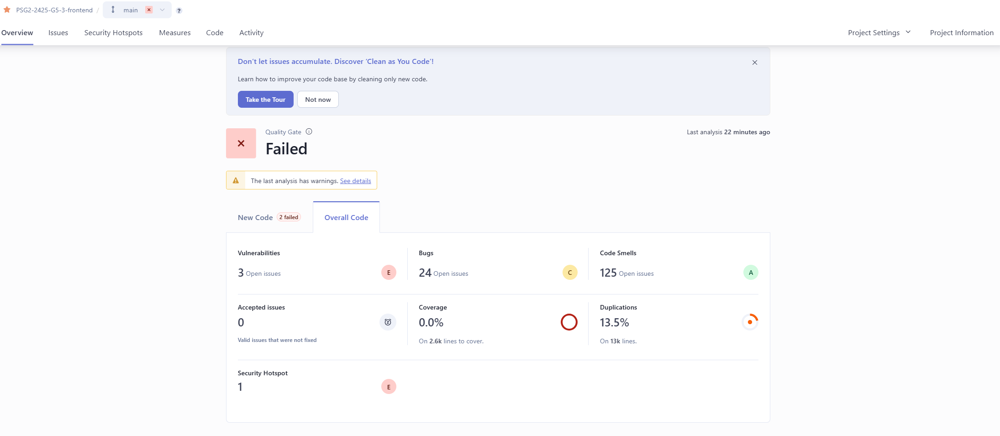
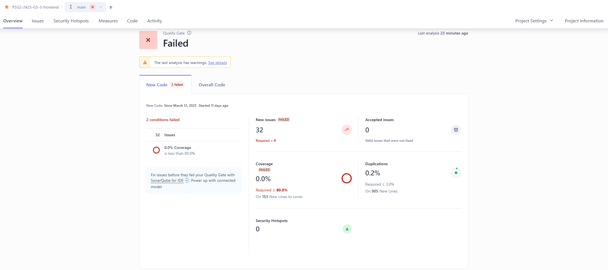

# Análisis del Código Fuente y Métricas Asociadas


## Miembros del equipo

| Nombre                        |
|-------------------------------|
| Adrián Robles Borrego         | 
| Lucía Ponce García de Sola    | 
| Lidia Ning Fernández Casillas | 
| Javier Luque Ruíz             | 
| Raquel Ortega Almirón         | 
| Borja Vera Casal              | 

## Historial de versiones  

| Versión | Fecha      | Descripción de cambios             |
|---------|------------|------------------------------------|
| 1.0.0   | 25/03/2025 | Versión inicial                    |


## Índice

1. [Introducción](#1-introducción)
2. [DashBoard de SonarQube](#2-dashboard-de-sonarqube)
3. [Análisis de Métricas](#3-análisis-de-métricas)
    1. [Resumen de Métricas - Backend](#31-resumen-de-métricas---backend)
    2. [Resumen de Métricas - Frontend](#32-resumen-de-métricas---frontend)
4. [Análisis de errores potenciales](#4-análisis-de-errores-potenciales)
    1. [Bugs - Backend](#41-bugs---backend)
    2. [Bugs - Frontend](#42-bugs---frontend)
5. [Análisis de Code Smells](#5-análisis-de-code-smells)
    1. [Code Smells en el Backend](#51-code-smells-en-el-backend)
    2. [Code Smells en el Frontend](#52-code-smells-en-el-frontend)
6. [Conclusiones](#6-conclusiones)


## 1. Introducción

En este informe se presenta el análisis del código fuente y las métricas asociadas de nuestro proyecto durante el Sprint 2. El análisis se ha realizado utilizando la herramienta SonarQube, que proporciona un conjunto de métricas clave para evaluar la calidad del código en términos de mantenibilidad, fiabilidad y seguridad. Este análisis abarca tanto el Backend como el Frontend de la aplicación, permitiendo detectar problemas potenciales, como bugs, code smells y vulnerabilidades.

Este análisis tiene como objetivo mejorar la calidad del software, asegurar la correcta evolución del proyecto y minimizar posibles problemas a lo largo del ciclo de desarrollo.

## 2. DashBoard de SonarQube

### **2.1. Backend**

- General
 

- Código Nuevo
 

### **2.2. Frontend**

- General


- Código Nuevo



## 3. Análisis de Métricas

El análisis de SonarQube nos proporciona métricas clave sobre la calidad del código en nuestro proyecto. A continuación, desglosamos los valores obtenidos analizando el nuevo código del sprint 2 y su impacto en la mantenibilidad y fiabilidad del código.

### **3.1. Resumen de Métricas - Backend**
- Dashboard del Backend comparado con el sprint anterior: 

    | Métrica                  | Valor   | Interpretación |
    |--------------------------|---------|---------------|
    | **Vulnerabilidades**     | 0       | No se detectaron vulnerabilidades de seguridad en el código. |
    | **Bugs**                | 5       | Se ha encontrado un nuevo error que podría afectar el funcionamiento del software. |
    | **Code Smells**         | 151     | Hay 20  problemas nuevos relacionados con la mantenibilidad del código. |
    | **Security Hotspots**   | 2       | No se ha encontrado ninguno nuevo. |
    | **Coverage (Cobertura de Tests)** | 70.06%  | Del nuevo código, solo un 20.1% ha sido probado, lo que indica un porcentaje bastante bajo de cobertura. |
    | **Duplications (Duplicación de código)** | 0.0% | No hay código duplicado, lo cual es positivo para la mantenibilidad. |

### **3.2. Resumen de Métricas - Frontend**
- Dashboard del frontend comparado con el sprint anterior:

    | Métrica                  | Valor   | Interpretación |
    |--------------------------|---------|---------------|
    | **Vulnerabilidades**     | 3        | Se ha detectado 1 nueva posible vulnerabilidad que requiere de una revisión. |
    | **Bugs**                | 24      | No se ha encontrado ningún bug nuevo |
    | **Code Smells**         | 125     | Hay 25 problemas nuevos relacionados con la mantenibilidad del código. |
    | **Security Hotspots**   | 1       | No se ha encontrado ninguno nuevo. |
    | **Coverage (Cobertura de Tests)** | 0.0%  | No hay cobertura de tests, lo que indica que el código no ha sido probado automáticamente. |
    | **Duplications (Duplicación de código)** | 13.5% | En el código nuevo solo hay un 0.2% de código duplicado. |


## 4. Análisis de errores potenciales

### **4.1. Bugs - Backend**


El análisis de errores potenciales (bugs) detectados por SonarQube en el backend muestra 1 problema abierto nuevo. En esta sección, identificaremos el tipo del error encontrado, su causa y su impacto en el sistema.

| Archivo y Tipo de Bug                  | Descripción   | Posible Causa | Severidad |
|--------------------------|-------------- |-------------- |--------- | 
| **BookingService.java** (`Call Optional#isPresent() or !Optional#isEmpty() before accessing the value.`) | Se accede a valores sin verificar si Optional está vacío | Falta de uso de `Optional#isPresent()` o `Optional#isEmpty()` | **Mayor** | 


### **4.2. Bugs - Frontend**

El análisis de SonarQube no ha identificado ningún bug nuevo en el código del frontend, resulado de las buenas prácticas llevadas a cabo en este sprint.


## 5. Análisis de Code Smells

### 5.1. Code Smells en el Backend
El análisis de SonarQube ha identificado un total de 151 code smells en el backend de nuestro proyecto, distribuidos de la siguiente manera:

- Gravedad Info: 8 code smells.

- Gravedad Minor: 41 code smells.

- Gravedad Major: 101 code smells.

- Gravedad Critical: 1 code smell.

A continuación, se analizará en detalle el code smell de gravedad critical, seguido de ejemplos representativos de los code smells major, minor e info.

### 5.1.1. Code Smell de Gravedad Critical

#### Inyección Directa de Dependencias

- **Descripción:** El valor del campo unauthorizedHandler solo se usa en el método configure, por lo que debería inyectarse directamente en dicho método para mejorar la encapsulación y reducir acoplamientos innecesarios.

- **Código afectado:**
```
@Autowired
private AuthEntryPointJwt unauthorizedHandler;
```

- **Solución:** Inyectar el valor directamente en el método configure en lugar de declararlo como un campo de clase.

### 5.1.2. Code Smells de Gravedad Major

#### Código Comentado Innecesario

- **Descripción:** Se ha detectado código comentado que no se está utilizando, lo que puede generar confusión y aumentar el desorden en el código.

- **Código afectado:**
```
<!-- <execution>
    <id>coverage-frontend</id>
    <goals>
        <goal>npm</goal>
    </goals>
    <phase>prepare-package</phase>
    <configuration>
        <arguments>run build</arguments>
    </configuration>
</execution> -->

```

- **Solución:** Eliminar el código comentado para mantener el código limpio y fácil de mantener.

### 5.1.3. Code Smells de Gravedad Minor

#### Importaciones no utilizadas

- **Descripción:** Se ha detectado una importación java.util.Collections que no está en uso, lo que añade complejidad innecesaria al código.

- **Código afectado:**
```
import java.util.Collections;
```

- **Solución:** Eliminar la importación no utilizada para mantener el código limpio.

### 5.1.4. Code Smells de Gravedad Info

#### Modificador public Innecesario en Métodos de Test

- **Descripción:** Los métodos de test de JUnit5 deberían tener visibilidad de paquete (default) en lugar de public para seguir las mejores prácticas y evitar exposiciones innecesarias.

- **Código afectado:**
```
@Test
@Transactional
public void shouldCreateAdminUser() {
```

- **Solución:** Eliminar el modificador public para que el método tenga visibilidad de paquete.

### 5.2. Code Smells en el Frontend

El análisis de SonarQube ha identificado un total de 125 code smells en el frontend de nuestro proyecto, distribuidos de la siguiente manera:

- Gravedad Minor: 57 code smells.

- Gravedad Major: 65 code smells.

- Gravedad Critical: 3 code smell.

A continuación, se analizará en detalle el code smell de gravedad critical, seguido de ejemplos representativos de los code smells major, minor e info.

#### 5.2.1. Code Smells de Gravedad Critical

#### Funciones Anidadas en Exceso

- **Descripción:**: El código contiene una función anidada más de 4 niveles, lo que dificulta la legibilidad y el mantenimiento.

- **Código afectado:**
```
setClinics((prevClinics) =>
    prevClinics.filter((c) => c.id !== clinic.id)
);
```

- **Solución:** Refactorizar el código para evitar la anidación excesiva de funciones, separando la lógica en funciones independientes.

#### 5.2.2. Code Smells de Gravedad Major

#### Espaciado Ambiguo entre Elementos

- **Descripción:** Se detectó un espaciado ambiguo entre elementos img en línea, lo que puede generar inconsistencias en la presentación visual.

- **Código afectado:**
```

```

- **Solución:** Añadir un margen explícito o un espaciado entre elementos para garantizar una alineación y separación consistentes.

#### 5.2.3. Code Smells de Gravedad Minor

#### Uso Redundante de Fragmentos en React

- **Descripción:**  Se utiliza un fragmento <></> con un único hijo, lo cual es innecesario y puede simplificarse.

- **Código afectado:**
```
if (role === "VET") {
    ownerLinks = (
        <>
            <NavItem>
                <NavLink style={{ color: "white" }} tag={Link} to="/consultations">Consultations</NavLink>
            </NavItem>
        </>
    );
}
```

- **Solución:** Eliminar el fragmento innecesario y dejar solo el elemento hijo.

## 6. Conclusiones
El análisis realizado durante el Sprint 2 ha permitido detectar y corregir problemas clave en el código, mejorando la calidad y mantenibilidad del proyecto. En el backend, aunque la seguridad y mantenibilidad son buenas, se han identificado algunos bugs y code smells críticos que requieren atención. La cobertura de tests es aceptable, pero puede mejorarse para aumentar la robustez del código.

En el frontend, la estabilidad ha mejorado al no encontrarse nuevos bugs, aunque la baja cobertura de tests y algunos problemas de mantenibilidad sugieren margen de mejora.

Las correcciones propuestas permitirán optimizar la calidad del código y facilitar el mantenimiento en futuros sprints. Mantener estas buenas prácticas será clave para garantizar un desarrollo eficiente y sostenible.