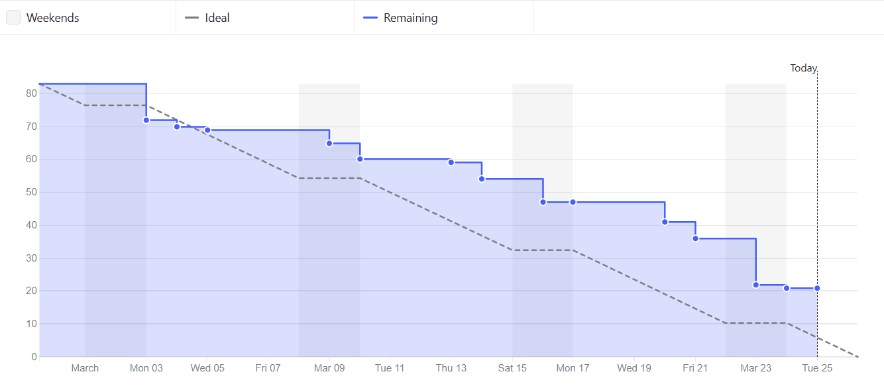
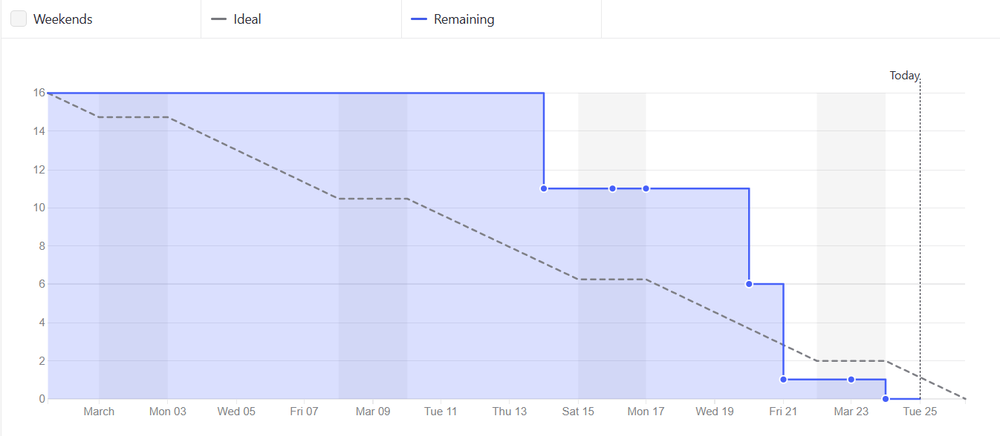
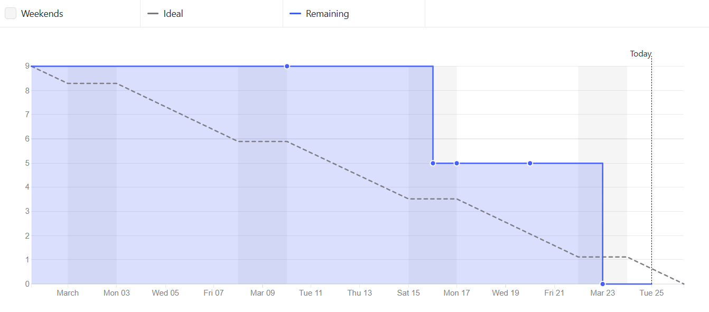
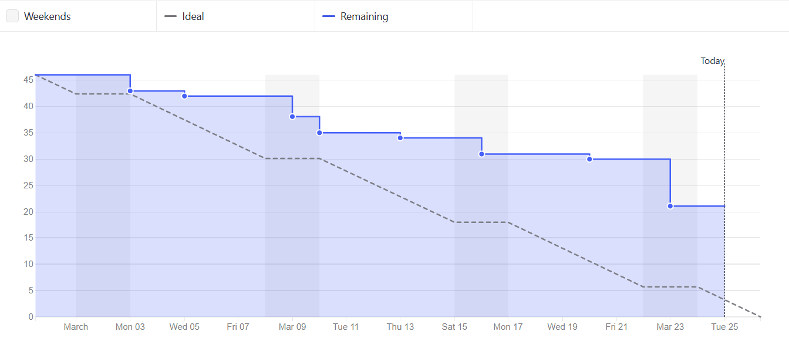
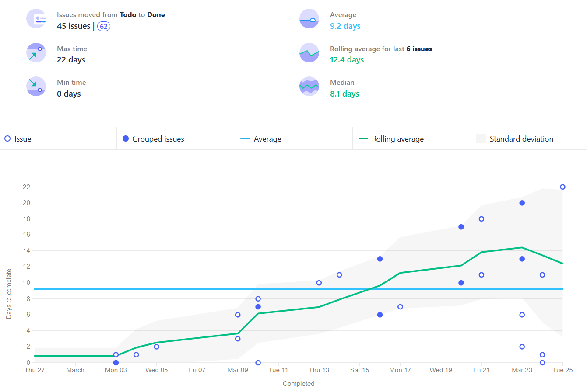
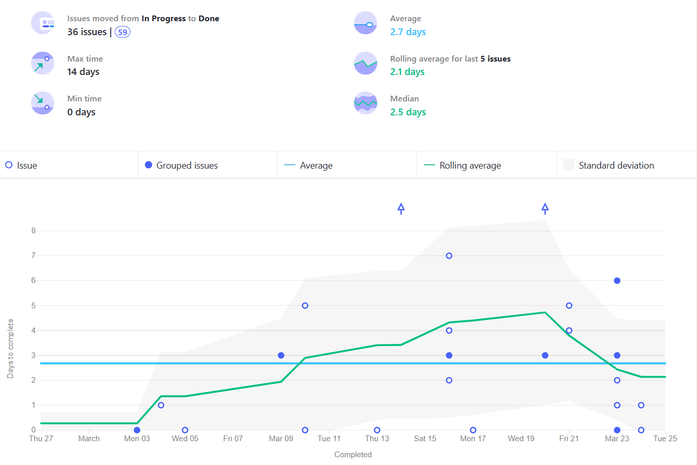
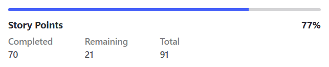
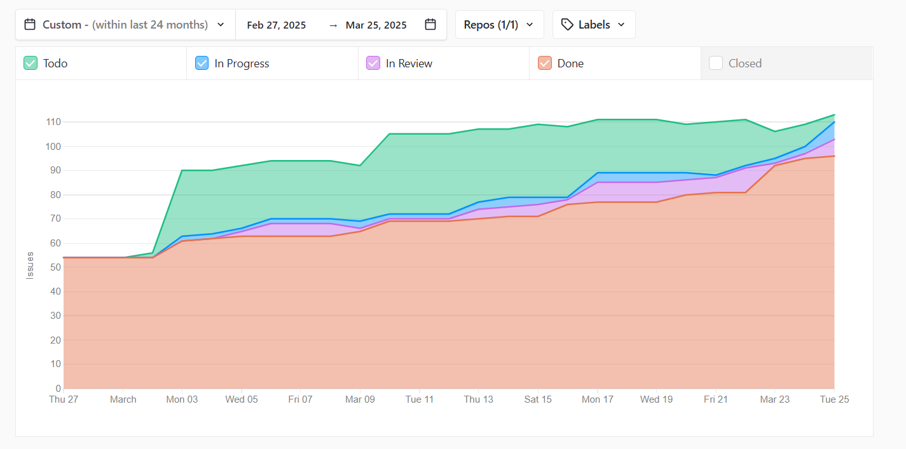

# Métricas de Proceso Ágil y Recursos

## Miembros del equipo

| Nombre                        |
|-------------------------------|
| Adrián Robles Borrego         | 
| Lucía Ponce García de Sola    | 
| Lidia Ning Fernández Casillas | 
| Javier Luque Ruíz             | 
| Raquel Ortega Almirón         | 
| Borja Vera Casal              | 

## Historial de versiones  

| Versión | Fecha       | Descripción de cambios |
|---------|------------|------------------------|
| 1.0.0   | 24/03/2025 | Versión inicial. Primeros gráficos añadidos. |
| 1.0.1   | 25/03/2025 | Primeros gráficos actualizados. |
| 1.0.2   | 25/03/2025 | Segunda parte con los gráficos correspondientes. |

## Índice
1. [Introducción](#1-introducción)
2. [Gráfico Milestone Burn Down](#2-gráfico-milestone-burn-down)
3. [Gráfico Lead Time](#3-gráfico-lead-time)
4. [Gráfico Cycle Time](#4-gráfico-cycle-time)
5. [Total puntos de historia entregados](#5-total-puntos-de-historia-entregados)
6. [Porcentaje de puntos de historia entregados](#6-porcentaje-de-puntos-de-historia-entregados)
7. [Gráfico Bottleneck](#7-gráfico-bottleneck)

## 1. Introducción

En este documento presentamos las principales métricas y recursos utilizados en metodologías ágiles, basados en los datos proporcionados por ZenHub, la herramienta de gestión de proyectos empleada en este trabajo. Evaluaremos la eficiencia del equipo, el flujo de trabajo y otros aspectos clave en relación con las actividades realizadas durante el Sprint 2. A través del análisis de estas métricas, buscamos establecer una guía para la mejora continua, optimizando el rendimiento del equipo y la entrega de valor en entornos de desarrollo ágil.

## 2. Gráfico Milestone Burn Down

Estos gráficos muestra la evolución del trabajo restante a lo largo del Sprint 2, comparando la cantidad de trabajo planificado con el tiempo disponible. Visualmente, representa cómo el equipo gestionó la finalización de tareas a lo largo del sprint en general y en los diferentes tipos de issues, indicando si el progreso fue constante, si hubo bloqueos o si se aceleró la entrega en los últimos días. Gracias a esta métrica, fue posible evaluar si el equipo se mantuvo alineado con los objetivos previstos y detectar posibles desviaciones en la planificación.

### Gráfico general

En el gráfico resultante, se observa que el equipo ha mantenido un ritmo constante en el desarrollo de los diferentes puntos de historia a lo largo del Sprint 2, con algunos aspectos clave a destacar.

Al inicio del sprint, se produce una primera bajada significativa en los puntos de historia, situando al equipo momentáneamente por debajo del progreso ideal. Esto indica un buen arranque del trabajo. Más adelante, el progreso supera la línea ideal, aunque sin alejarse demasiado de ella, lo que demuestra que, si bien no es un avance completamente lineal, se ha mantenido una constancia en todo momento.

Los momentos de mayor actividad y entrega de issues se concentran principalmente los fines de semana, como lo reflejan las caídas más pronunciadas en los puntos de historia durante esas fechas. Sin embargo, también se evidencia un progreso continuo durante la semana, lo que denota el compromiso y entusiasmo del equipo con el trabajo en curso.

En comparación con la gráfica correspondiente obtenida en el sprint 1, podemos notar una notable mejora y un trabajo mucho más constante en este sprint 2, haciendo evidente, la consciencia y decisiones que tomó el equipo tras ver los resultados del primer sprint.

### Gráfico filtrado por issues de backend

El gráfico resultante muestra el progreso de los puntos de historia y las issues relacionadas con funcionalidades de backend. Se observa que el trabajo en estas tareas no comienza hasta el jueves 13 de marzo, lo que sugiere que las primeras actividades del sprint estuvieron enfocadas en otros aspectos, posiblemente tareas más simples o de diferente naturaleza.

Destacan dos caídas pronunciadas en el progreso entre el miércoles 19 y el viernes 21 de marzo, situando el avance por debajo de la línea ideal. Finalmente, todas las tareas fueron entregadas el 23 de marzo.

En conclusión, aunque el desarrollo de las funcionalidades de backend inició con cierto retraso, los puntos de historia fueron completados a tiempo, asegurando la entrega antes de la fecha límite.

### Gráfico filtrado por issues de frontend

El gráfico resultante muestra el progreso de los puntos de historia y las issues relacionadas con funcionalidades de frontend. Al igual que en el caso del backend, se observa que estas tareas no comienzan hasta bien avanzada la segunda mitad del sprint. Esto se debe a que, para poder desarrollar las funcionalidades de frontend, primero era necesario completar las tareas de backend correspondientes, generando un efecto dominó en el retraso del inicio.

A pesar de este comienzo tardío, una vez iniciadas, el progreso fue bastante rápido y constante, con dos descensos significativos en los puntos de historia, ambos ocurriendo durante los fines de semana. La última caída marcó la finalización de todas las issues de frontend, logrando completarlas con margen antes de la fecha de entrega.

### Gráfico filtrado por issues de documentación

El gráfico resultante muestra el progreso de los puntos de historia y las issues relacionadas con la documentación del proyecto. A diferencia de los dos gráficos anteriores, este refleja un avance notablemente más constante.

Aunque la documentación suele ser una tarea más tediosa y requiere que el desarrollo esté finalizado para completarse, el equipo hizo un esfuerzo por mantener los documentos actualizados en todo momento. Se observa que, a medida que avanzaba el sprint, el progreso comenzó a desacelerarse y a alejarse de la línea ideal. Sin embargo, conforme se acercaba la fecha de entrega y se finalizaban las reuniones y tareas pendientes, el ritmo de entrega de los puntos de historia se intensificó, logrando un cierre efectivo de la documentación.

## 3. Gráfico Lead Time

El gráfico Lead Time refleja el tiempo total transcurrido desde que una tarea fue registrada en el estado _To Do_, indicando que estaba pendiente de ser trabajada, hasta que alcanzó el estado _Done_, señalando su finalización durante el Sprint 2. Esta métrica permite evaluar la eficiencia del flujo de trabajo, identificando posibles retrasos y oportunidades de mejora en el proceso de desarrollo.

El gráfico resultante muestra que el tiempo promedio para la entrega de las issues fue de 7.6 días. En general, no se observan issues o grupos de issues que se desvíen significativamente de esta media, ya que la mayoría permanecen dentro de la zona gris que representa la media móvil, salvo algunas excepciones que se completaron en un tiempo mucho menor al estimado.

Analizando la media móvil, se observa que al inicio del sprint esta es baja, lo que indica que, en los primeros días, la mayoría de las issues fueron resueltas más rápido de lo previsto. Sin embargo, conforme avanza el sprint, la media móvil comienza a aumentar, reflejando un mayor tiempo de entrega. Esto coincide con el desarrollo de las issues relacionadas con funcionalidades más complejas, que requirieron mayor esfuerzo.

Hacia la fase final del sprint, la tendencia se revierte y las issues empiezan a entregarse en menos tiempo, lo que provoca una disminución en la media móvil. En conclusión, aunque algunas tareas resultaron más exigentes que otras, todas fueron completadas sin desviaciones significativas en los plazos estimados.

## 4. Gráfico Cycle Time

El gráfico Cycle Time presenta el tiempo total transcurrido desde que una tarea comenzó a estar en el estado _In Progress_ hasta su finalización en el estado _Done_ durante el Sprint 2. Esta métrica permite evaluar la eficiencia del flujo de trabajo del equipo, identificando posibles cuellos de botella, variabilidad en los tiempos de entrega y áreas de mejora en el proceso de desarrollo. A través del análisis del Cycle Time, es posible obtener información valiosa sobre la velocidad de trabajo y la capacidad de entrega del equipo en este primer sprint.

El gráfico resultante muestra que el tiempo medio de entrega de las issues es de 2 días y medio. Sin embargo, se observan variaciones significativas, con algunas issues completadas mucho antes de lo previsto y otras que, por el contrario, tomaron más tiempo del esperado, lo que provocó un aumento en la media móvil.

Destacan dos incrementos pronunciados en la media móvil, representados por flechas ascendentes, así como una issue que tardó 7 días en completarse. Las flechas corresponden a las tareas de implementación del backend de la funcionalidad de adopciones, que enfrentaron problemas y terminaron tomando más de 8 días en resolverse. Por otro lado, la issue que tardó 7 días se relaciona con la implementación del frontend de las reservas. En este caso, la demora se debió a que la tarea fue marcada como in progress antes de que el backend estuviera completamente finalizado, lo que obligó a la persona responsable a detener su trabajo y esperar hasta su conclusión para poder continuar.

A pesar de estos retrasos puntuales, el gráfico muestra que, con el tiempo, la media móvil fue disminuyendo, lo que indica que el resto de las issues se entregaron en un plazo razonable y dentro de lo esperado.

## 5. Total puntos de historia entregados
El total de puntos de historia entregados refleja la cantidad de trabajo completado durante el Sprint 2, medido en función de las estimaciones iniciales asignadas a cada tarea.

Durante el Sprint actual, el equipo logró completar un total de 70 puntos de historia de los 91 planificados. Aunque el análisis se realiza antes de la finalización del sprint, la tendencia sugiere que las tareas restantes serán completadas a tiempo, permitiendo alcanzar el objetivo establecido.

La capacidad de entrega demuestra una ejecución eficiente y un ritmo de trabajo constante, lo que sugiere que el equipo ha mantenido una planificación adecuada y ha gestionado correctamente las tareas asignadas.

## 6. Porcentaje de puntos de historia entregados
El porcentaje de puntos de historia entregados refleja la efectividad del equipo en relación con las expectativas iniciales de entrega.

En este sprint, el equipo ha logrado completar el 77% de los puntos de historia planificados hasta el momento, con la expectativa de alcanzar el 100% antes del cierre del sprint. Este porcentaje refleja que:

- El equipo ha mantenido un ritmo de trabajo sólido y constante, acercándose al cumplimiento total de los objetivos del sprint.

- La alta tasa de entrega sugiere que la planificación ha sido efectiva y que las estimaciones de esfuerzo han sido, en gran medida, acertadas.

- La ligera diferencia entre los puntos entregados y los planificados indica que aún hay margen para finalizar todas las tareas a tiempo, demostrando una ejecución bien gestionada y coordinada.

Si el equipo mantiene esta tendencia y evita bloqueos en los puntos restantes, se espera que el sprint concluya con éxito, consolidando la capacidad del equipo para estimar y ejecutar tareas de manera eficiente.

## 7. Gráfico Bottleneck
El gráfico Bottleneck o Diagrama de Flujo Acumulado muestra la evolución de las tareas a lo largo del Sprint 2, diferenciando entre los estados de To Do, In Progress, In Review y Done. Este gráfico permite identificar posibles cuellos de botella en el proceso de desarrollo, ya que revela en qué fase del flujo de trabajo se acumulan las tareas.

### Análisis:

#### Inicio del Sprint:

- El sprint comienza con alrededor de 50 tareas en el estado Done, lo que indica que se partió con un buen volumen de trabajo ya completado.

- Hay un incremento brusco en la acumulación de tareas en el estado To Do (verde) alrededor del 3 de marzo, lo que sugiere una carga inicial de trabajo importante.

#### Progreso durante el Sprint:

- Entre el 3 y el 9 de marzo, las tareas en In Progress (azul) y In Review (morado) aumentan gradualmente, lo que indica que el equipo comenzó a trabajar de manera constante.

- La sección de To Do (verde) se estabiliza después del 9 de marzo, lo que indica que no se añadieron muchas más tareas después de ese punto.

#### Cuellos de Botella:

- Se observa un ligero estancamiento en la fase In Review (morado) entre el 11 y el 19 de marzo, lo que podría señalar un cuello de botella en el proceso de revisión o aprobación.

- El 19 de marzo, las tareas en In Review empiezan a ser resueltas, y esto se refleja en el incremento de las tareas Done (rojo).

#### Final del Sprint:

- Hacia el 25 de marzo, el volumen de tareas completadas alcanza el punto más alto, lo que indica que el equipo logró resolver el cuello de botella y cerrar la mayoría de las tareas a tiempo.

- La cantidad de tareas en In Progress y In Review se reduce notablemente al cierre del sprint, lo que sugiere que el equipo logró un buen flujo de trabajo hacia el final del sprint.

- En el gráfico no se ven que se completan todas las tareas, dado que el gráfico se obtuvo varias horas antes de finalizar el sprint, por lo que faltan tareas por completar.

El equipo mostró un buen ritmo de trabajo y capacidad de entrega constante. El cuello de botella en la fase de revisión fue identificado y resuelto antes del final del sprint. La acumulación inicial de tareas se gestionó bien, ya que las tareas pendientes (verde) no crecieron significativamente después de la primera semana.