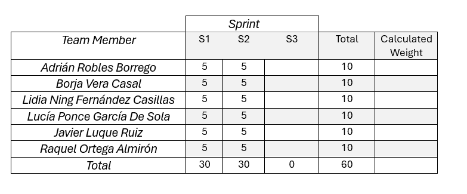

# Informe de Retrospectiva

## Índice

1. [Introducción](#1-introducción)
2. [Miembros Del Equipo De Trabajo](#2-miembros-del-equipo-de-trabajo)
3. [Evaluación De Los Métodos Del Equipo Y Posibles Mejoras](#3-evaluación-de-los-métodos-del-equipo-y-posibles-mejoras)
4. [Plan De Acción](#4-plan-de-acción)
5. [Tabla De Rendimiento](#5-tabla-de-rendimiento)

---

## **1. Introducción**
El siguiente documento nos permite identificar qué aspectos se han realizado correctamente durante el sprint 2 y elaborar un plan de mejora para optimizar aquellos que requieren ajustes en el próximo sprint.

---

## **2. Miembros del equipo de trabajo**
- Adrián Robles Borrego.
- Borja Vera Casal.
- Lidia Ning Fernández Casillas.
- Lucía Ponce García De Sola.
- Javier Luque Ruiz.
- Raquel Ortega Almirón.

---

## **3. Evaluación de los métodos del equipo y posibles mejoras**
En esta sección se presentan las propuestas de mejora del equipo para optimizar su desempeño, luego de analizar la situación al cierre del segundo sprint.  

- **Roles y responsabilidades bien definidos:** En este sprint, los roles dentro del equipo se han establecido correctamente, contando con un project manager que ha facilitado la organización y toma de decisiones.  
- **Mejor aplicación de Planning Poker:** Se ha mejorado la estimación de tareas con Planning Poker, aunque aún no se ha logrado votar todas las tareas. Será importante continuar refinando este proceso para asegurar una estimación más completa.  
- **Fortalecimiento de la documentación:** La documentación ha mejorado significativamente, incorporando portada, índices y ejemplos, lo que facilita su comprensión y uso.  
- **Entrega de puntos de historia más continua:** A diferencia del Sprint 1, en este sprint se ha logrado un flujo de entrega más constante, evitando acumulaciones de trabajo en los últimos días.  
- **Mayor comunicación y agilidad en las revisiones:** La comunicación ha sido más fluida y efectiva, lo que ha permitido que las revisiones de pull requests se realicen de manera más estructurada y rápida en comparación con el sprint anterior.  

---

## **4. Plan de acción**
Este plan de acción tiene como propósito definir medidas específicas para optimizar la eficiencia y el desempeño del equipo. Se organiza en tres categorías: Start, Stop y Continue Doing, donde se identificarán las actividades que el equipo debe comenzar, dejar de hacer y seguir realizando, respectivamente. Con esta estructura, el equipo podrá enfocarse en los aspectos clave para mejorar su rendimiento y alcanzar sus objetivos. Algunas de estas acciones ya han sido mencionadas previamente.

### 🆕 Start:
- Optimizar la asignación de tareas considerando la carga de trabajo total mediante la evaluación de la complejidad de cada tarea.
- Mejorar la retrospectiva y la retroalimentación de manera constructiva.

### ❌ Stop:
- Detener la procrastinación y abordar de inmediato los problemas y desafíos que surjan durante el desarrollo del proyecto.
- Detener la asignación de tareas sin una comunicación clara sobre las expectativas y los plazos, lo que puede generar confusión y retrasos.

### ✅ Continue Doing: 
Se utilizan porcentajes para mostrar el grado de cumplimiento de las siguientes practicas de equipo, un porcentaje alto indica que se ha cumplido con creces el área de prácticas: 
- Mantener los daily meetings para evaluar el progreso del equipo y hacer ajustes según sea necesario. --> (85%)
- Continuar empleando ZenHub para llevar una correcta organización de las tareas. --> (90%)
- Mantener la obligación de que otro miembro del equipo tenga que evaluar el commit antes de poder ser subido. --> (100%)
- Mantener un ambiente de trabajo positivo para promover el crecimiento y el éxito del equipo. --> (90%)

---

## **5. Tabla de rendimiento**
Esta sección se centra en la evaluación del desempeño individual. Luego de un análisis justo del rendimiento durante el sprint, se ha determinado que todos los miembros del equipo recibirán la misma puntuación final, dado que hemos aportado equitativamente al proyecto. A continuación, se presenta la tabla de rendimiento final para este segundo sprint.

 