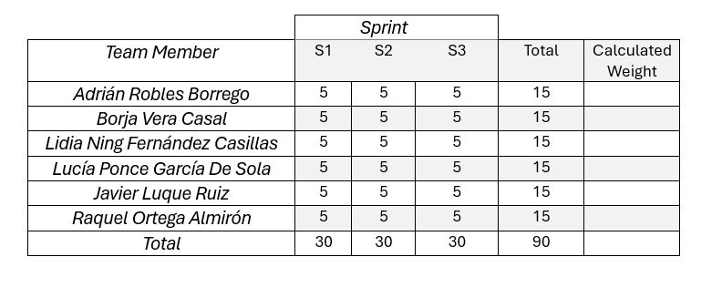

# Informe de Retrospectiva Sprint 3

 

## Índice

1. [Introducción](#1-introducción)
2. [Miembros Del Equipo De Trabajo](#2-miembros-del-equipo-de-trabajo)
3. [Evaluación De Los Métodos Del Equipo Y Posibles Mejoras](#3-evaluación-de-los-métodos-del-equipo-y-posibles-mejoras)
4. [Plan De Acción](#4-plan-de-acción)
5. [Tabla De Rendimiento](#5-tabla-de-rendimiento)

---

## **1. Introducción**
El siguiente documento nos permite identificar qué aspectos se han realizado correctamente durante el sprint 3 y elaborar un plan de mejora para optimizar aquellos que requieren ajustes en el próximo sprint.

---

## **2. Miembros del equipo de trabajo**
- Adrián Robles Borrego.
- Borja Vera Casal.
- Lidia Ning Fernández Casillas.
- Lucía Ponce García De Sola.
- Javier Luque Ruiz.
- Raquel Ortega Almirón.

---

## **3. Evaluación de los métodos del equipo y posibles mejoras**
Durante este sprint, el equipo ha mejorado notablemente en la asignación equitativa de tareas, aplicando la técnica de Planning Poker para estimar los puntos de historia de cada ítem. Esta metodología ha permitido un reparto justo del trabajo y una mayor implicación de todos los miembros.

No obstante, la gestión del tiempo sigue siendo un área de mejora. El Milestone Burndown muestra una acumulación significativa de tareas hacia el final del sprint, lo que provocó una carga excesiva en los últimos días. Aunque se completó casi todo el trabajo planificado, una tarea clave quedó pendiente: la integración del sistema de precios (Pricing4SaaS) en el frontend. A pesar de múltiples intentos por parte del equipo, no se logró integrar correctamente debido a diversas dificultades técnicas.

Este tipo de obstáculos técnicos pone en evidencia la necesidad de detectar dependencias y riesgos técnicos con antelación para evitar bloqueos importantes al cierre del sprint.

---

## **4. Plan de acción**
Este plan de acción tiene como propósito definir medidas específicas para optimizar la eficiencia y el desempeño del equipo. Se organiza en tres categorías: Start, Stop y Continue Doing, donde se identificarán las actividades que el equipo debe comenzar, dejar de hacer y seguir realizando, respectivamente. Con esta estructura, el equipo podrá enfocarse en los aspectos clave para mejorar su rendimiento y alcanzar sus objetivos.

### 🆕 Start:
- Abordar primero las tareas más complejas o técnicas al inicio del sprint, para disponer de margen de maniobra en caso de bloqueos o imprevistos.

- Incluir revisiones técnicas tempranas en los dailys para detectar tareas que podrían complicarse, especialmente integraciones o dependencias externas.

### ❌ Stop:
- Posponer tareas hasta el final del sprint, especialmente aquellas críticas para el avance de otras funcionalidades.

- Estimar las tareas sin considerar la disponibilidad real de los miembros durante el sprint

### ✅ Continue Doing: 
- Usar Planning Poker para estimar los puntos de historia de forma colaborativa.

- Repartir las tareas de forma equitativa, teniendo en cuenta las fortalezas y cargas de cada miembro del equipo.

---

## **5. Tabla de rendimiento**
Esta sección se centra en la evaluación del desempeño individual. Luego de un análisis justo del rendimiento durante el sprint, se ha determinado que todos los miembros del equipo recibirán la misma puntuación final, dado que hemos aportado equitativamente al proyecto. A continuación, se presenta la tabla de rendimiento final para este segundo sprint.

 